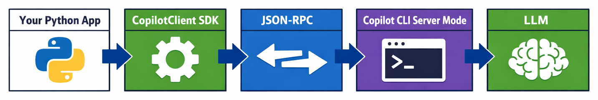

# Chapter 00 — Getting Started with the Copilot SDK


<!-- TODO: Add banner image to ./00-getting-started/images/banner.png — A warm, inviting illustration (1280×640) showing a developer at their terminal, with a speech bubble from an AI assistant displaying a friendly "Hello!" response. Use the same art style as the repo banner. -->

> **Install the SDK, run your first prompt, and understand the client → session → message pattern that powers everything you'll build.**

This chapter is where your journey begins! You'll set up the GitHub Copilot SDK, send your first prompt, and understand the mental model that makes it all work. By the end, you'll have a working "hello world" agent and the foundation for the Issue Reviewer capstone project.

> ⚠️ **Prerequisites**: Make sure you have **Python 3.9+** installed, a **GitHub account with Copilot access**, and the **[GitHub Copilot CLI](https://docs.github.com/en/copilot/how-tos/set-up/install-copilot-cli)** installed and authenticated.

## 🎯 Learning Objectives

By the end of this chapter, you'll be able to:

- Explain what the GitHub Copilot SDK is and how it differs from chat-based AI
- Install the SDK and verify your setup
- Send your first prompt and receive a response
- Understand the agent mental model (client → session → message)

> ⏱️ **Estimated Time**: ~30 minutes (10 min reading + 20 min hands-on)

---

# Your First Copilot SDK Experience

Jump right in and see what the Copilot SDK can do.

---

## 🧩 Real-World Analogy: Calling a Help Desk

Using the Copilot SDK is like calling a company's help desk:

| Help Desk | Copilot SDK | What It Does |
|---|---|---|
| Dial the phone number | `CopilotClient()` | Connects you to the service |
| Press call and wait for someone to answer | `client.create_session(...)` | Opens a conversation with context and rules |
| Ask your question | `session.send_and_wait(...)` | Sends a message and waits for a response |
| Hang up when done | `await client.stop()` | Closes the connection cleanly |

You wouldn't call a help desk and immediately start talking without being connected to someone first. Similarly, the SDK requires you to create a **client** (connect), start a **session** (ring and have someone answers the phone), and then exchange **messages**. This "client → session → message" flow is the backbone of everything you'll build in this course.


<!-- TODO: Add analogy image to ./00-getting-started/images/analogy-help-desk.png — An illustration showing a developer on a phone (left), connected through a switchboard (middle, labeled "Client → Session"), to a friendly AI agent at a desk (right, labeled "Message exchange"). Clean, warm style matching course art. -->

---

# Key Concepts



Let's understand what you're working with before diving into code.

Imagine you're a developer who reviews dozens of GitHub issues every day. Some are simple bug fixes, others require deep system knowledge. Wouldn't it be great if an AI assistant could read each issue, understand the codebase, and give you a structured analysis — automatically?

That's exactly what you'll build in this course, using the **GitHub Copilot SDK**.

The GitHub Copilot SDK lets you embed Copilot's agentic workflows directly into your own applications. Instead of just chatting with an AI, you can create custom workflows, apps, and APIs with specified **tools**, **instructions**, and **structure**. This allows you to bring the automation that you access through Copilot tools, but bring it in the form of a programmable agent that can leverage provided tools and complete actions in your own tools and systems.

In this first chapter, you'll install the SDK, send your first prompt, and see a response come back. It's that simple to get started.

---

## What Is the GitHub Copilot SDK?

The **GitHub Copilot SDK** is a Python library (also available in TypeScript, Go, and .NET) that lets you build AI agents in code. It connects to the same engine that powers the Copilot CLI, so you can send prompts, define tools, and get structured responses — all from a regular Python script. You could use it to build things like code review bots, issue triagers, documentation generators, or test writers.

Key abilities: structured output, tool calling, an automatic agent loop (think → call tool → read result → respond), streaming, and session hooks for safety.


<!-- TODO: Add diagram to ./00-getting-started/images/sdk-architecture.png — Architecture diagram showing: "Your Python App" → "CopilotClient (SDK)" → "JSON-RPC" → "Copilot CLI (server mode)" → "LLM". Use clean boxes and arrows. -->

Under the hood, the SDK communicates with the Copilot CLI via **JSON-RPC** and manages the CLI process lifecycle automatically. You authenticate through your GitHub account or a token.

---

## SDK vs. Chat Completion APIs

You may have used OpenAI's API or similar chat completion services. How is the Copilot SDK different?

| Feature | Chat Completion API | Copilot SDK |
|---------|-------------------|-------------|
| **Purpose** | Single request/response | Agent workflows with planning |
| **Tools** | You implement tool loop | Built-in tool orchestration |
| **File access** | Manual | Built-in file tools |
| **Authentication** | API key | GitHub Copilot subscription |
| **Orchestration** | You build it | SDK handles planning, tool calls, retries |

> 💡 **Tip:** Think of the Copilot SDK as a "batteries-included" agent framework — you define what the agent should do, and Copilot handles the how.

---

## The Agent Mental Model

Working with the SDK follows a simple three-step pattern:

1. **Create a Client** — connects to the Copilot CLI server.
2. **Create a Session** — an ongoing conversation with a model.
3. **Send Messages** — prompts that the agent responds to.

```
CopilotClient (manages connection)
  └── CopilotSession (a conversation)
        └── send() / sendAndWait() (messages)
              └── Events (responses, tool calls, streaming)
```

---

## Basic Message Structure

When you send a message, the SDK:

1. Delivers your prompt to the model
2. The model generates a response (potentially calling tools)
3. Events are emitted back to your code
4. The session becomes idle when processing completes

---

# See It In Action

Let's write your first Copilot SDK program. This minimal example sends a prompt and prints the response.

> 💡 **About Example Outputs**: The sample outputs shown throughout this course are illustrative. Because AI responses vary each time, your results will differ in wording, formatting, and detail. Focus on the *type* of information returned, not the exact text.

## Step 1: Set Up Your Project

```bash
mkdir copilot-issue-reviewer && cd copilot-issue-reviewer
python -m venv .venv
source .venv/bin/activate  # On Windows: .venv\Scripts\activate
pip install github-copilot-sdk
```

## Step 2: Verify the Copilot CLI

```bash
copilot --version
```

You should see a version number. If not, follow the [Copilot CLI installation guide](https://docs.github.com/en/copilot/how-tos/set-up/install-copilot-cli).

## Step 3: Your First Agent

Create a file called `hello_agent.py`:

```python
import asyncio
from copilot import CopilotClient


async def main():
    # Step 1: Create a client (connects to Copilot CLI)
    client = CopilotClient()
    await client.start()

    # Step 2: Create a session (a conversation with a model)
    session = await client.create_session({"model": "gpt-4.1"})

    # Step 3: Send a message and wait for the response
    response = await session.send_and_wait({"prompt": "What is 2 + 2?"})

    # Print the response
    print(response.data.content)

    # Clean up
    await session.destroy()
    await client.stop()


asyncio.run(main())
```

<details>
<summary>🤖 Generate this with a prompt</summary>

Copy this prompt into GitHub Copilot Chat or your preferred AI assistant:

```text
Create a minimal Python script called hello_agent.py that uses the GitHub Copilot SDK.
It should:
1. Import asyncio and CopilotClient from copilot
2. Create an async main function
3. Create a CopilotClient and start it
4. Create a session with the gpt-4.1 model
5. Send "What is 2 + 2?" and wait for a response
6. Print the response content
7. Clean up by destroying the session and stopping the client
8. Run with asyncio.run(main())

Add comments explaining each step.
```

</details>

Run it:

```bash
python hello_agent.py
```

You should see:

```
4
```

🎉 **Congratulations!** You've just run your first Copilot SDK agent.

<details>
<summary>🎬 See it in action!</summary>


<!-- TODO: Add GIF to ./00-getting-started/images/hello-agent-demo.gif — A terminal recording showing: (1) python hello_agent.py command, (2) brief pause, (3) "4" output. Keep it short and clean. -->

*Demo output varies. Your results will differ from what's shown here.*

</details>

---

## Step 4: Try a Concept Demo

Now let's try something more relevant to our capstone — asking the model to summarize a GitHub issue description:

```python
import asyncio
from copilot import CopilotClient


SAMPLE_ISSUE = """
Title: Login page crashes on mobile Safari

When users try to log in using Safari on iOS 17, the page crashes after
clicking the "Sign In" button. The error in the console shows:
TypeError: Cannot read properties of undefined (reading 'focus')

This happens because the autofocus directive is trying to reference a
DOM element that hasn't rendered yet on mobile browsers.

Steps to reproduce:
1. Open the app on iOS Safari
2. Navigate to /login
3. Enter credentials and click "Sign In"
4. Page crashes with white screen
"""


async def main():
    client = CopilotClient()
    await client.start()

    session = await client.create_session({"model": "gpt-4.1"})

    response = await session.send_and_wait({
        "prompt": f"Summarize this GitHub issue in 2-3 sentences:\n\n{SAMPLE_ISSUE}"
    })

    print("Issue Summary:")
    print(response.data.content)

    await session.destroy()
    await client.stop()


asyncio.run(main())
```

<details>
<summary>🤖 Generate this with a prompt</summary>

Copy this prompt into GitHub Copilot Chat or your preferred AI assistant:

```text
Create a Python script using the GitHub Copilot SDK that summarizes a GitHub issue.
It should:
1. Define a SAMPLE_ISSUE string containing a multi-line GitHub issue about a
   login page crash on mobile Safari (include title, description, and repro steps)
2. Create a CopilotClient, start it, and create a session with gpt-4.1
3. Send the issue to the model asking for a 2-3 sentence summary
4. Print "Issue Summary:" followed by the response
5. Clean up the session and client

Use async/await with asyncio.run(main()).
```

</details>


<!-- TODO: Add screenshot to ./00-getting-started/images/terminal-output.png — A terminal screenshot showing the output of the concept demo script: "Issue Summary:" followed by a 2-3 sentence AI-generated summary of the sample issue. Show a clean terminal with readable text. -->

<details>
<summary>🎬 See it in action!</summary>


<!-- TODO: Add GIF to ./00-getting-started/images/issue-summary-demo.gif — A terminal recording showing: (1) python issue_summary.py command, (2) "Issue Summary:" header appears, (3) AI-generated summary text streams in. -->

*Demo output varies. Your results will differ from what's shown here.*

</details>

> 💡 **Try it yourself:** Modify the `SAMPLE_ISSUE` text with a real issue from one of your GitHub repositories and see how the summary changes.

---

# Practice


<!-- TODO: Add shared practice image to ./images/practice.png — A warm desk setup with monitor showing code, lamp, coffee cup, and headphones ready for hands-on practice. Reuse across all chapters. -->

Time to put what you've learned into action.

---

## ▶️ Try It Yourself

After completing the demos above, try these variations:

1. **Change the prompt** — Instead of "Summarize this issue", try "What is the root cause of this issue?"

2. **Add system instructions** — Add a `system_message` to give the model a persona:
   ```python
   session = await client.create_session({
       "model": "gpt-4.1",
       "system_message": {
           "mode": "replace",
           "content": "You are a senior software engineer reviewing GitHub issues."
       }
   })
   ```

3. **Try a different question** — Ask the model to suggest a fix for the issue

4. **Inspect the response** — Print `response.type` and `response.data` to explore the response object structure

---

## 📝 Assignment

### Main Challenge: Build Your First Issue Summarizer

Create a Python script called `issue_summary.py` that:

1. Creates a `CopilotClient` and starts it
2. Creates a session with the `gpt-4.1` model
3. Sends a hardcoded GitHub issue to the model asking for a summary
4. Prints the summary to the terminal
5. Cleans up the session and client properly

**Success criteria**: Your script runs without errors and prints a sensible summary.

See [assignment.md](./assignment.md) for full instructions and stretch goals.

<details>
<summary>💡 Hints</summary>

**Basic structure:**
```python
import asyncio
from copilot import CopilotClient

async def main():
    client = CopilotClient()
    await client.start()
    # ... your code here ...
    await client.stop()

asyncio.run(main())
```

**Common issues:**
- Forgetting `await` on async calls
- Not cleaning up with `client.stop()`
- Missing the `asyncio.run(main())` at the bottom

</details>

---

<details>
<summary>🔧 Common Mistakes & Troubleshooting</summary>

| Mistake | What Happens | Fix |
|---------|--------------|-----|
| Forgetting `await` | `TypeError: 'coroutine' object is not subscriptable` | Add `await` before all async SDK calls |
| Not calling `client.stop()` | Process hangs or orphaned CLI process | Always clean up in a try/finally block |
| Copilot CLI not installed | `FileNotFoundError` or connection error | Install CLI: `brew install github/gh/copilot-cli` or see docs |
| Not authenticated | Authentication error | Run `copilot auth login` in terminal first |

### Troubleshooting

**"Connection refused"** — The Copilot CLI isn't running. Make sure it's installed and you're authenticated.

**"Model not available"** — Your subscription may not include all models. Try `gpt-4.1` which is widely available.

**Script hangs forever** — You likely forgot to call `await client.stop()`. Press Ctrl+C and add the cleanup code.

</details>

---

## 🧠 Knowledge Check

Test your understanding:

1. **What is the correct order of steps when using the SDK?**
   - a) Create a session, then create a client, then send a message
   - b) Create a client, create a session, then send a message ✅
   - c) Send a message, then create a client and session

2. **Why must you call `await client.stop()` at the end of your script?**
   - a) To save the conversation history
   - b) To shut down the background Copilot process cleanly ✅
   - c) To submit the response to GitHub

3. **What does `create_session()` do?**
   - a) Authenticates with GitHub
   - b) Opens a conversation context with a system prompt and model configuration ✅
   - c) Installs the SDK dependencies

---

# Summary

## 🔑 Key Takeaways

1. **The SDK is batteries-included** — it handles tool orchestration, retries, and the agent loop for you
2. **Client → Session → Message** — this three-step pattern is the foundation of everything you'll build
3. **Always clean up** — call `session.destroy()` and `client.stop()` to avoid orphaned processes
4. **Async all the way** — the SDK uses Python's async/await, so all calls need `await`

> 📚 **Glossary**: New to terms like "agent", "session", or "token"? See the [Glossary](../GLOSSARY.md) for definitions.

---

## 🏗️ Capstone Progress

| Chapter | Feature Added | Status |
|---------|--------------|--------|
| **00** | **Basic issue summary** | **🔲 ← You are here** |
| 01 | Structured output with rich fields | 🔲 |
| 02 | Reliable classification | 🔲 |
| 03 | Tool calling (file fetch) | 🔲 |
| 04 | Streaming UX | 🔲 |
| 05 | Safety & guardrails | 🔲 |
| 06 | Production & GitHub integration | 🔲 |

---

## ➡️ What's Next

Now that you can send prompts and receive responses, let's make those responses **structured and predictable**. 

In **[Chapter 01: Structured Output](../01-structured-output/README.md)**, you'll learn:

- Why free-form text is unreliable for automation
- How to constrain model output to JSON schemas
- Using Pydantic for validation

You'll upgrade your Issue Reviewer to return structured data instead of prose — the first step toward a production-ready tool.

---

## Additional Resources

> 📚 **Official Documentation**: [GitHub Copilot SDK](https://github.com/github/copilot-sdk) — full API reference and guides
>
> 📋 **Quick Reference**: [Python SDK README](https://github.com/github/copilot-sdk/blob/main/python/README.md) — setup, configuration, and examples

- 📚 [Getting Started Guide](https://github.com/github/copilot-sdk/blob/main/docs/getting-started.md)
- 📚 [Copilot CLI Installation](https://docs.github.com/en/copilot/how-tos/set-up/install-copilot-cli)

---

**[← Back to Course Home](../README.md)** | **[Continue to Chapter 01 →](../01-structured-output/README.md)**
