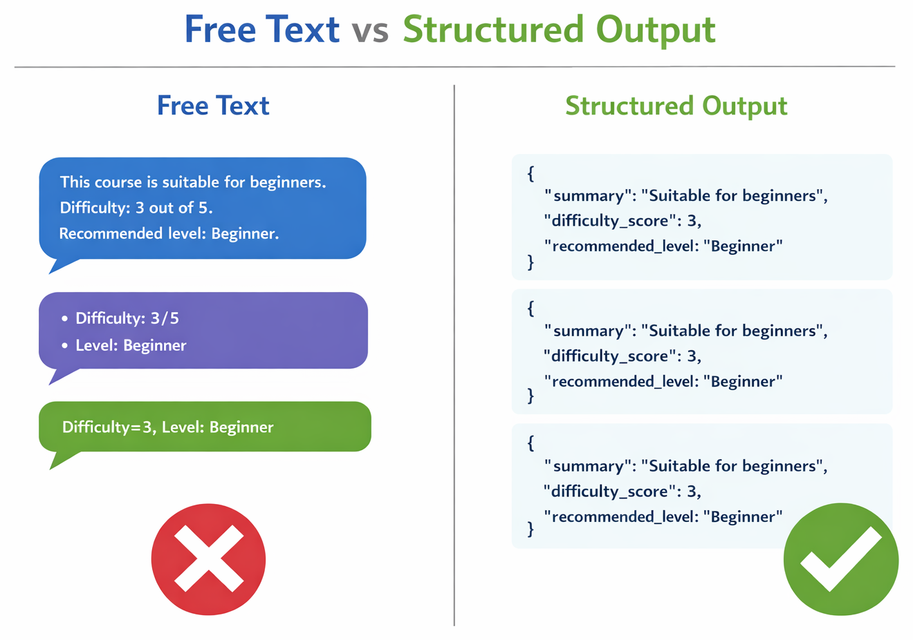
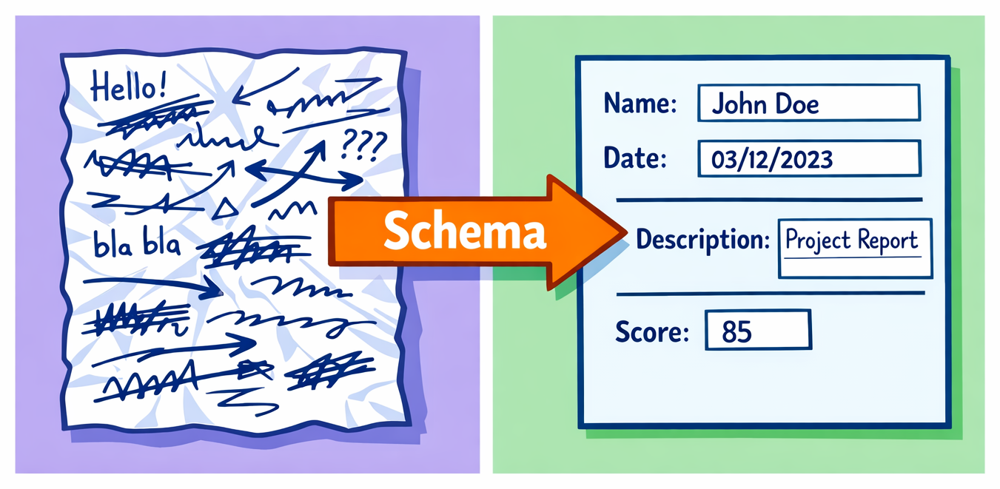

# Chapter 01 — Structured Output: Stop Parsing Strings


> **If you're parsing AI output with regex, you're doing it wrong. Learn to constrain model output to predictable, validated JSON.**

In Chapter 00, you got free-form text summaries. That works for humans — but what if you want to build a dashboard, apply labels automatically, or feed the output into another system? You need **structured, machine-readable data**. This chapter teaches you how to get it.

> ⚠️ **Prerequisites**: Make sure you've completed **[Chapter 00: Getting Started](../00-getting-started/README.md)** first. You'll need `github-copilot-sdk` and `pydantic` installed.

## 🎯 Learning Objectives

By the end of this chapter, you'll be able to:

- Explain why structured output matters for reliable AI applications
- Use system prompts to request JSON responses from the model
- Define Pydantic models to validate model output
- Handle validation errors gracefully

> ⏱️ **Estimated Time**: ~35 minutes (10 min reading + 25 min hands-on)

---

# Why Structured Output Matters



When you ask a model for free-form text, you get responses that vary in format every time:

```
"This is a medium-difficulty issue, probably a 3 out of 5..."
"Difficulty: Medium (3/5)"
"I'd rate this as moderately difficult."
```

All say roughly the same thing, but parsing any of these programmatically is fragile. **Structured output** solves this by having the model return a consistent JSON object:

```json
{
  "summary": "Login crash on mobile Safari due to premature autofocus",
  "difficulty_score": 3,
  "recommended_level": "Mid"
}
```

---

## 🧩 Real-World Analogy: Forms vs. Letters



Imagine you ask 10 people to describe a car accident. If you say *"Tell me what happened,"* you'll get 10 wildly different stories — different lengths, different details, different formats.

But if you hand them **a form** — with fields for date, location, vehicles involved, injuries, and a description — you'll get 10 responses you can actually compare, file, and process.

| Approach | AI Equivalent | Result |
|---|---|---|
| "Tell me what happened" | Free-form prompt | Unpredictable text you have to parse |
| Hand them a form | Structured output with a schema | Consistent, machine-readable data |

That's exactly what structured output does. Instead of hoping the model returns data in a useful format, you give it a **form** (a Pydantic schema) that defines exactly what fields to fill in. The model can still be creative in *what* it says, but the *shape* of the answer is guaranteed.

---

# Key Concepts

Let's understand the building blocks before diving into code.

**The pattern in this chapter — Schema → Validate → Enforce — is how you make any AI output reliable and type-safe.**

<details>
<summary>🧭 Framework You Can Reuse Later: Schema-First Agent Design (optional on first read)</summary>

If this is your first pass, you can skip this and come back after the demos.

Structured output is useful far beyond issue review. The reusable framework is:

1. Define the response schema first
2. Instruct the model to return only that schema
3. Validate every response before using it
4. Reject or retry on invalid output

| Agent Type | Schema Example |
|---|---|
| Issue reviewer | summary, difficulty, recommended_level |
| Support triage bot | category, priority, suggested_reply |
| Security reviewer | risk_level, impacted_components, remediation |
| Release assistant | change_type, rollout_risk, required_checks |

</details>

---

## How to Get Structured Output

With the Copilot SDK, you get structured output by being explicit in your **system message**. You tell the model exactly what JSON shape to return and instruct it to respond only with JSON.

---

## Validating with Pydantic

[Pydantic](https://docs.pydantic.dev/) is a Python library for data validation. You define a model class with typed fields, and Pydantic validates that incoming data matches your schema.

```python
from pydantic import BaseModel, Field

class IssueAnalysis(BaseModel):
    summary: str = Field(description="One-sentence summary of the issue")
    difficulty_score: int = Field(ge=1, le=5, description="Difficulty from 1-5")
    recommended_level: str = Field(description="Junior, Mid, Senior, or Senior+")
```

<details>
<summary>🤖 Generate this with a prompt</summary>

Copy this prompt into GitHub Copilot Chat or your preferred AI assistant:

```text
Create a Pydantic BaseModel called IssueAnalysis with these fields:
- summary: str — one-sentence summary of the issue
- difficulty_score: int — constrained between 1 and 5 (use ge/le)
- recommended_level: str — one of Junior, Mid, Senior, or Senior+

Use Field() with descriptions for each field.
```

</details>

When the model returns JSON, you parse it with Pydantic:

```python
import json
from copilot.generated.session_events import AssistantMessageData

# Check the response type, then parse with Pydantic
if response and isinstance(response.data, AssistantMessageData):
    data = json.loads(response.data.content)
    analysis = IssueAnalysis(**data)
    print(analysis.difficulty_score)  # Guaranteed to be an int between 1-5
```

> ⚠️ **Warning:** The model might occasionally return invalid JSON or miss fields. Always wrap parsing in a try/except block.

---

# See It In Action

Let's compare free-form responses with structured output.

> 💡 **About Example Outputs**: The sample outputs shown throughout this course are illustrative. Because AI responses vary each time, your results will differ in wording, formatting, and detail.

## The Problem: Loose Text Responses

First, let's see what happens with a free-form response:

```python
import asyncio
from copilot import CopilotClient
from copilot.session import PermissionHandler
from copilot.generated.session_events import AssistantMessageData

SAMPLE_ISSUE = """
Title: Database connection pool exhaustion under load

Our PostgreSQL connection pool runs out of connections during peak hours.
The app uses SQLAlchemy with a pool size of 10. Under load testing with
100 concurrent users, we see "QueuePool limit exceeded" errors after
about 2 minutes. Need to implement connection pooling with PgBouncer
or increase pool size with proper timeout handling.
"""

async def main():
    client = CopilotClient()
    await client.start()
    session = await client.create_session(
        on_permission_request=PermissionHandler.approve_all,
        model="gpt-4.1",
    )

    response = await session.send_and_wait(
        f"Analyze this GitHub issue and tell me the difficulty level:\n\n{SAMPLE_ISSUE}"
    )

    print("Free-form response:")
    if response and isinstance(response.data, AssistantMessageData):
        print(response.data.content)
    # Output varies! Could be a paragraph, a list, a number... unpredictable.

    await session.disconnect()
    await client.stop()

asyncio.run(main())
```

<details>
<summary>🤖 Generate this with a prompt</summary>

Copy this prompt into GitHub Copilot Chat or your preferred AI assistant:

```text
Create a Python script using the GitHub Copilot SDK that demonstrates the problem
with free-form AI responses. It should:
1. Define a SAMPLE_ISSUE about database connection pool exhaustion
2. Send it to gpt-4.1 asking for difficulty level analysis
3. Print the free-form response
4. Add a comment noting the output format varies each run

Use CopilotClient with async/await.
```

</details>

Every time you run this, the format changes. Not great for automation.

---

## The Solution: Structured JSON Response

Now, let's constrain the output with a system message and Pydantic validation:

Choose your adventure:
1. **Code-first**: use the ready-made script.
2. **Prompt-first**: generate it yourself, then compare.

<details>
<summary>💻 Option A (Code-first): Use the complete example</summary>

```python
import asyncio
import json
from copilot import CopilotClient
from copilot.session import PermissionHandler
from copilot.generated.session_events import AssistantMessageData
from pydantic import BaseModel, Field


class IssueAnalysis(BaseModel):
    """Schema for structured issue analysis output."""
    summary: str = Field(description="One-sentence summary of the issue")
    difficulty_score: int = Field(
        ge=1, le=5,
        description="Difficulty from 1 (trivial) to 5 (expert-level)"
    )
    recommended_level: str = Field(
        description="One of: Junior, Mid, Senior, Senior+"
    )


SYSTEM_PROMPT = """You are a GitHub issue analyzer. When given an issue, respond
with ONLY a JSON object (no markdown, no code fences, no extra text) matching
this exact schema:

{
  "summary": "One-sentence summary of the issue",
  "difficulty_score": 1-5,
  "recommended_level": "Junior | Mid | Senior | Senior+"
}

Rules:
- difficulty_score must be an integer from 1 to 5
- recommended_level must be exactly one of: Junior, Mid, Senior, Senior+
- summary must be a single sentence
- Return ONLY the JSON object, nothing else
"""

SAMPLE_ISSUE = """
Title: Database connection pool exhaustion under load

Our PostgreSQL connection pool runs out of connections during peak hours.
The app uses SQLAlchemy with a pool size of 10. Under load testing with
100 concurrent users, we see "QueuePool limit exceeded" errors after
about 2 minutes. Need to implement connection pooling with PgBouncer
or increase pool size with proper timeout handling.
"""


async def main():
    client = CopilotClient()
    await client.start()

    session = await client.create_session(
        on_permission_request=PermissionHandler.approve_all,
        model="gpt-4.1",
        system_message={
            "mode": "replace",
            "content": SYSTEM_PROMPT,
        }
    )

    response = await session.send_and_wait(
        f"Analyze this GitHub issue:\n\n{SAMPLE_ISSUE}"
    )

    # Parse and validate the response
    try:
        if not response or not isinstance(response.data, AssistantMessageData):
            print("Error: No text response received")
            return
        raw = response.data.content
        data = json.loads(raw)
        analysis = IssueAnalysis(**data)

        print(f"Summary:     {analysis.summary}")
        print(f"Difficulty:  {analysis.difficulty_score}/5")
        print(f"Level:       {analysis.recommended_level}")
    except json.JSONDecodeError:
        print("Error: Model did not return valid JSON")
        if response and isinstance(response.data, AssistantMessageData):
            print(f"Raw response: {response.data.content}")
    except Exception as e:
        print(f"Validation error: {e}")

    await session.disconnect()
    await client.stop()


asyncio.run(main())
```

</details>

<details>
<summary>🤖 Option B (Prompt-first): Generate this with a prompt</summary>

Copy this prompt into GitHub Copilot Chat or your preferred AI assistant:

```text
Create a Python script using the GitHub Copilot SDK that returns structured JSON
output for issue analysis. It should:
1. Define a Pydantic IssueAnalysis model with: summary (str), difficulty_score
   (int 1-5), and recommended_level (str: Junior/Mid/Senior/Senior+)
2. Create a SYSTEM_PROMPT that tells the model to respond with ONLY a JSON object
   matching the schema (no markdown, no extra text)
3. Define a SAMPLE_ISSUE about database connection pool exhaustion
4. Create a session with "mode": "replace" for the system message
5. Parse the response with json.loads() and validate with the Pydantic model
6. Print the summary, difficulty score, and level
7. Handle JSONDecodeError and ValidationError with try/except

Use CopilotClient with async/await.
```

</details>

Now the output is **consistent, predictable, and validated**. Every run produces the same shape of data.

**The takeaway**: A system prompt + Pydantic schema transforms unpredictable AI output into reliable, structured data.

> ✅ **Milestone: Machine-Readable Output** — Your Issue Reviewer now returns validated, structured data instead of free text. Every field is typed and constrained. You've crossed the line from "AI toy" to "AI component you can build on."

---

# Practice


Time to put what you've learned into action.

---

## ▶️ Try It Yourself

After completing the demos above, try these experiments:

1. **Add a new required field** — Add `estimated_hours: int` to the schema and update the system prompt

2. **Add a list field** — Add `concepts_required: list[str]` to capture the skills needed to solve the issue

3. **Break the schema intentionally** — Remove a required field from the system prompt but keep it in Pydantic. What error do you get?

4. **Test edge cases** — What happens with a very short issue? A very long one?

---

## 📝 Assignment

### Main Challenge: Build a Rich Issue Analyzer

Extend your Issue Reviewer from Chapter 00 to return structured output with multiple fields:

1. Define a Pydantic `IssueAnalysis` model with:
   - `summary: str` — One-sentence summary
   - `difficulty_score: int` — 1-5 scale
   - `recommended_level: str` — Junior, Mid, Senior, or Senior+
   - `concepts_required: list[str]` — Specific skills needed (e.g., "JWT validation", not vague like "security")
   - `mentoring_advice: str` — Guidance appropriate to the difficulty level

2. Create a system prompt that instructs the model to return JSON matching this schema

3. Parse and validate the response with Pydantic

4. Handle errors gracefully with try/except

**Success criteria**: Running your script produces validated JSON with all fields populated appropriately.

> 💡 **Tip**: For `concepts_required`, tell the model to be specific in your system prompt. Give examples: "✅ JWT token validation, Python decorators" vs "❌ security, coding (too vague)"

See [assignment.md](./assignment.md) for full instructions.

<details>
<summary>💡 Hints</summary>

**Full schema:**
```python
class IssueAnalysis(BaseModel):
    summary: str = Field(description="One-sentence summary")
    difficulty_score: int = Field(ge=1, le=5)
    recommended_level: str = Field(description="Junior, Mid, Senior, or Senior+")
    concepts_required: list[str] = Field(description="Specific skills needed")
    mentoring_advice: str = Field(description="Guidance for the difficulty level")
```

**System prompt structure:**
```python
SYSTEM_PROMPT = """You are a GitHub issue analyzer. 
Respond with ONLY a JSON object matching this schema:
{
  "summary": "...",
  "difficulty_score": 1-5,
  "recommended_level": "Junior | Mid | Senior | Senior+",
  "concepts_required": ["specific skill 1", "specific skill 2"],
  "mentoring_advice": "..."
}

For concepts_required, be specific:
✅ "JWT token validation", "Python decorator pattern"
❌ "security", "coding" (too vague)
"""
```

**Common issues:**
- Model returns JSON wrapped in ```json code fences — strip them before parsing
- Model returns `difficulty_score` as a string — Pydantic will try to coerce it, but be explicit in your prompt
- Forgetting to use `"mode": "replace"` in the system message

</details>

---

<details>
<summary>🔧 Common Mistakes & Troubleshooting</summary>

| Mistake | What Happens | Fix |
|---------|--------------|-----|
| Not using `"mode": "replace"` | Default system prompt interferes with JSON output | Always use `"mode": "replace"` when you need strict output format |
| Forgetting try/except | Script crashes on invalid JSON | Wrap `json.loads()` and Pydantic parsing in try/except |
| Schema mismatch | Pydantic raises `ValidationError` | Ensure system prompt schema matches Pydantic model exactly |
| Model adds markdown fences | `json.loads()` fails | Strip ```json and ``` before parsing |

### Troubleshooting

**"JSONDecodeError: Expecting value"** — The model didn't return valid JSON. Print `response.data.content` to see what it actually returned.

**"ValidationError: 1 validation error"** — The JSON is valid but doesn't match your Pydantic schema. Check field names and types.

**Model ignores your schema** — Make your system prompt more explicit. Add "Return ONLY the JSON object, nothing else."

</details>

---

## 🧠 Knowledge Check

Test your understanding:

1. **Why is structured output better than free-form text for automation?**
   - a) It uses less tokens
   - b) It produces a predictable format that code can parse reliably ✅
   - c) It makes the model respond faster

2. **What role does Pydantic play in structured output?**
   - a) It sends requests to the Copilot API
   - b) It validates that the model's JSON response matches your expected schema ✅
   - c) It generates the system prompt automatically

3. **What does `"mode": "replace"` do in the session configuration?**
   - a) It replaces the default model with a custom model
   - b) It replaces the SDK's default system prompt with your own ✅
   - c) It replaces the previous session

---

# Wrap-Up

## ✅ What You Can Do Now

1. **Free-form text is unreliable** — different runs produce different formats that break parsers
2. **System prompts define the contract** — tell the model exactly what JSON shape to return
3. **Pydantic validates the response** — catch errors early instead of debugging downstream
4. **Always handle errors** — wrap parsing in try/except because models occasionally misbehave

> 📚 **Glossary**: New to terms like "schema" or "validation"? See the [Glossary](../GLOSSARY.md) for definitions.

---

<details>
<summary>📦 Optional: Progress and reference</summary>

## 🏗️ Capstone Progress

| Chapter | Feature Added | Status |
|---------|--------------|--------|
| 00 | Basic issue summary | ✅ |
| **01** | **Structured output with rich fields** | **🔲 ← You are here** |
| 02 | Reliable classification | 🔲 |
| 03 | Tool calling (file fetch) | 🔲 |
| 04 | Streaming UX | 🔲 |
| 05 | Safety & guardrails | 🔲 |
| 06 | Production & GitHub integration | 🔲 |

---

## ▶️ Next Step

Your output is now structured — but is it *consistent*? Run the same issue through your analyzer multiple times. You might get a difficulty score of 3 one time and 4 the next.

In **[Chapter 02: Prompt Engineering](../02-prompt-engineering/README.md)**, you'll learn:

- How to write rubrics that make classification reliable
- Using few-shot examples to guide model behavior
- Temperature and its effect on consistency

You'll make your Issue Reviewer produce the same answer every time — essential for an automated system.

---

## Additional Resources

> 📚 **Official Documentation**: [GitHub Copilot SDK](https://github.com/github/copilot-sdk) — full API reference and guides
>
> 📋 **Quick Reference**: [Python SDK README](https://github.com/github/copilot-sdk/blob/main/python/README.md) — setup, configuration, and examples

- 📚 [Pydantic Documentation](https://docs.pydantic.dev/)
- 📚 [GitHub Copilot SDK — System Message Customization](https://github.com/github/copilot-sdk/blob/main/python/README.md#system-message-customization)
- 📚 [JSON Schema Specification](https://json-schema.org/)

## Ship-Readiness Checklist

- [ ] System prompt explicitly demands JSON-only output
- [ ] Pydantic model validates all required fields and ranges
- [ ] JSON parsing is wrapped in try/except with clear error handling
- [ ] Invalid responses are retried or safely rejected
- [ ] Output schema aligns with downstream automation needs

</details>

---

**[← Back to Chapter 00](../00-getting-started/README.md)** | **[Continue to Chapter 02 →](../02-prompt-engineering/README.md)**
