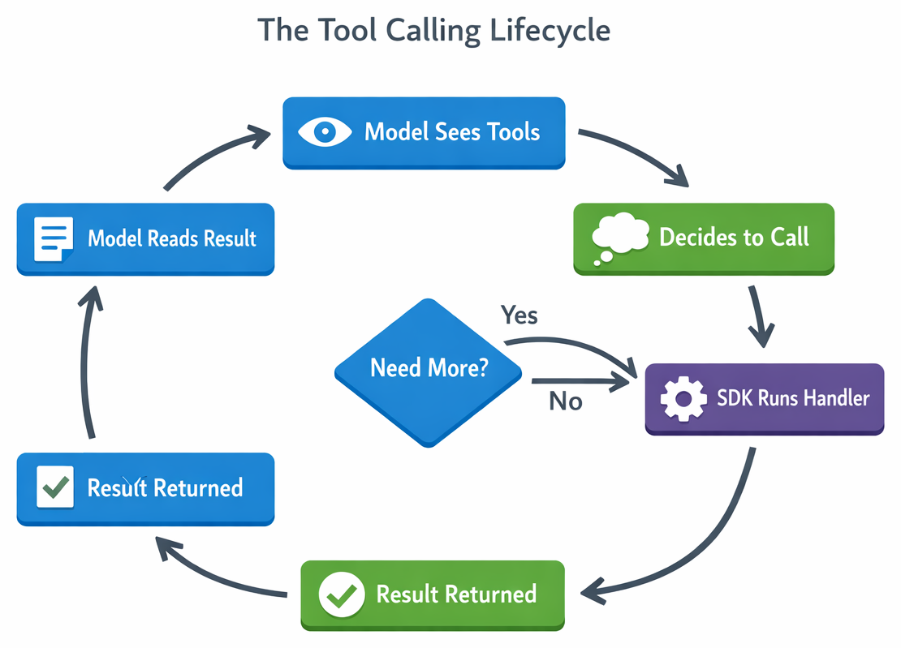

# Chapter 03 — Tool Calling: Giving the Agent Capabilities


<!-- TODO: Add banner image to ./03-tool-calling/images/banner.png — An illustration (1280×640) showing an AI agent with extending tool arms: one holds a file/document, another connects to a GitHub icon, a third holds a magnifying glass. Shows the agent gaining capabilities. Same art style as course. -->

> **An agent without tools is just a chatbot. Tools give your agent the ability to interact with the real world — reading files, calling APIs, and taking action.**

So far, your Issue Reviewer can analyze issue text that you paste into the prompt. But in the real world, issues often reference files. This chapter teaches you how to give your agent **tools** — the ability to fetch information and take actions on its own.

> ⚠️ **Prerequisites**: Make sure you've completed **[Chapter 02: Prompt Engineering](../02-prompt-engineering/README.md)** first. You'll need your rubric-based system prompt.

## 🎯 Learning Objectives

By the end of this chapter, you'll be able to:

- Explain what tools are in the context of AI agents
- Define custom tools using `@define_tool` and Pydantic models
- Understand the tool invocation lifecycle
- Give the agent the ability to read repository files

> ⏱️ **Estimated Time**: ~45 minutes (15 min reading + 30 min hands-on)

---

# Giving Your Agent Capabilities

## 🧩 Real-World Analogy: Giving the New Hire Building Access


<!-- TODO: Add analogy image to ./03-tool-calling/images/analogy-building-access.png — An illustration showing an employee at a desk, then using a key card to enter a file room, retrieving a folder, and returning to their desk with the information. An arrow labeled "@define_tool" points at the key card. Same art style as course. -->

Remember the employee you trained in Chapter 02? So far, they've been grading essays by reading only the cover sheet you hand them. If a student's essay says *"See appendix B for supporting data,"* your employee has to shrug — they can't go look at it.

Now imagine you give them a **key card** to the building's file room. When they encounter a reference, they can walk over, pull the file, read it, and come back with a much better analysis.

| Without Tools | With Tools |
|---|---|
| "The issue mentions `login.py` but I can't see it" | Agent reads `login.py` and includes the code in its analysis |
| Guesses based on the issue description alone | Makes informed judgments based on actual source code |
| Limited to what's in the prompt | Can go find what it needs |

That's exactly what tools do. The `@define_tool` decorator is the key card — it gives the agent permission and ability to access specific resources. The agent decides *when* to use the tool (like the employee deciding when to visit the file room) and the SDK handles the back-and-forth.

---

# Key Concepts

Let's understand the core concepts behind tool calling.

---

## What Are Tools?

A **tool** is a function you expose to the model that extends its capabilities. In the real world, issues often reference specific files:

> "The bug is in `src/auth/login.py` — the `validate_credentials()` function doesn't handle expired tokens."

Wouldn't it be great if the agent could **read that file itself** and include the code in its analysis? That's what tools enable — the model can choose to call them when it needs additional information or actions.

Each tool has:

1. **A name** — how the model refers to it (e.g., `get_file_contents`)
2. **A description** — helps the model decide when to use it
3. **Parameters** — what arguments the tool accepts (defined as a schema)
4. **A handler** — the actual Python function that runs



<!-- TODO: Add diagram to ./03-tool-calling/images/tool-lifecycle.png — A circular flow diagram: (1) "Model sees available tools" → (2) "Model decides to call a tool" → (3) "SDK runs your handler function" → (4) "Result returned to model" → (5) "Model incorporates result into response" → back to (2) if more tools needed, or → (6) "Final response". -->

---

## The Tool Schema

Tools are defined using Pydantic models (for type-safe schemas) and the `@define_tool` decorator:

```python
from pydantic import BaseModel, Field
from copilot import define_tool

class GetFileParams(BaseModel):
    file_path: str = Field(description="Path to the file in the repository")

@define_tool(description="Read the contents of a file from the repository")
async def get_file_contents(params: GetFileParams) -> str:
    with open(params.file_path, "r") as f:
        return f.read()
```

---

## How the Model Chooses Tools

When you provide tools, the model can:
1. **Call a tool** if it needs information to answer the prompt
2. **Call multiple tools** in sequence for multi-step reasoning
3. **Skip tools entirely** if it can answer without them

You don't tell the model *when* to use tools — the model decides based on the prompt and available tools.

> 💡 **Tip:** Write clear, specific tool descriptions. The model uses the description to decide when a tool is appropriate.

---

# See It In Action

Let's create a tool that reads files from a local repository.

> 💡 **About Example Outputs**: The sample outputs shown throughout this course are illustrative. Because AI responses vary each time, your results will differ in wording, formatting, and detail.

## Defining a File Reader Tool

```python
import asyncio
import json
import os
from copilot import CopilotClient, define_tool
from pydantic import BaseModel, Field


class GetFileParams(BaseModel):
    file_path: str = Field(description="Relative path to the file in the repository")


# Define the tool — the model can call this when it needs file contents
@define_tool(description="Read the contents of a file from the repository")
async def get_file_contents(params: GetFileParams) -> str:
    """Read a file from the local repository."""
    repo_root = os.environ.get("REPO_PATH", ".")
    full_path = os.path.join(repo_root, params.file_path)

    # Safety: prevent path traversal
    full_path = os.path.realpath(full_path)
    if not full_path.startswith(os.path.realpath(repo_root)):
        return "Error: Access denied — path is outside the repository"

    try:
        with open(full_path, "r") as f:
            return f.read()
    except FileNotFoundError:
        return f"Error: File not found: {params.file_path}"
    except Exception as e:
        return f"Error reading file: {e}"
```

<details>
<summary>🤖 Generate this with a prompt</summary>

Copy this prompt into GitHub Copilot Chat or your preferred AI assistant:

```text
Create a file-reading tool for the GitHub Copilot SDK. It should:
1. Define a GetFileParams Pydantic model with a file_path field (str)
2. Use @define_tool decorator with a description about reading repository files
3. The handler should:
   - Read REPO_PATH from an environment variable (default ".")
   - Join the repo root with the requested file path
   - Add path traversal protection using os.path.realpath() to ensure the
     resolved path stays within the repo root
   - Return "Access denied" if the path escapes the repo
   - Handle FileNotFoundError gracefully
   - Return the file contents as a string

Import os, and use copilot's define_tool and pydantic's BaseModel/Field.
```

</details>

---

## Using the Tool in a Session

Now let's pass the tool to a session and let the model use it:

```python
SYSTEM_PROMPT = """You are a GitHub issue analyzer with access to repository files.

When an issue references specific files, use the get_file_contents tool to read
those files and include code context in your analysis.

Respond with ONLY a JSON object:
{
  "summary": "<one sentence>",
  "difficulty_score": 1-5,
  "recommended_level": "Junior | Mid | Senior | Senior+",
  "files_analyzed": ["<list of files you read>"]
}
"""

ISSUE_WITH_FILE_REFS = """
Title: Fix authentication bypass in login handler

The login handler in src/auth/login.py has a vulnerability where
expired JWT tokens are still accepted. The validate_token() function
in src/auth/tokens.py doesn't check the 'exp' claim properly.
"""


async def main():
    client = CopilotClient()
    await client.start()

    session = await client.create_session({
        "model": "gpt-4.1",
        "system_message": {"mode": "replace", "content": SYSTEM_PROMPT},
        "tools": [get_file_contents],  # Pass your tool to the session
    })

    # The model will detect file references and call get_file_contents
    response = await session.send_and_wait({
        "prompt": f"Analyze this issue:\n\n{ISSUE_WITH_FILE_REFS}"
    })

    print(response.data.content)

    await session.destroy()
    await client.stop()


asyncio.run(main())
```

<details>
<summary>🤖 Generate this with a prompt</summary>

Copy this prompt into GitHub Copilot Chat or your preferred AI assistant:

```text
Create a Python script using the GitHub Copilot SDK that passes a file-reading
tool to a session. It should:
1. Create a SYSTEM_PROMPT telling the model it's a GitHub issue analyzer with
   access to repository files, and to use get_file_contents when issues
   reference specific files. Output should be JSON with summary, difficulty_score,
   recommended_level, and files_analyzed fields.
2. Define a test issue about an authentication bypass that references
   src/auth/login.py and src/auth/tokens.py
3. Create a session with the system prompt (mode: replace) and pass the
   get_file_contents tool in the tools list
4. Send the issue and print the response

Use CopilotClient with async/await.
```

</details>

---

## Watching Tool Calls in Action

To see when the model calls your tool, add event listeners:

```python
def on_event(event):
    if event.type.value == "tool.execution_start":
        print(f"🔧 Tool called: {event.data.tool_name}")
        print(f"   Arguments: {event.data.arguments}")
    elif event.type.value == "tool.execution_complete":
        print(f"✅ Tool complete: {event.data.tool_name}")

session.on(on_event)
```

<details>
<summary>🤖 Generate this with a prompt</summary>

Copy this prompt into GitHub Copilot Chat or your preferred AI assistant:

```text
Create an event listener function for the GitHub Copilot SDK that logs tool calls.
The function should:
1. Check event.type.value for "tool.execution_start" and print the tool name
   and arguments with a wrench emoji
2. Check for "tool.execution_complete" and print a checkmark with the tool name
3. Register it with session.on(on_event)
```

</details>


<!-- TODO: Add GIF to ./03-tool-calling/images/tool-calling-demo.gif — An animated terminal recording showing: (1) User runs the script, (2) "🔧 Tool called: get_file_contents" appears with file path argument, (3) "✅ Tool complete" appears, (4) Model calls a second file, (5) Final JSON analysis is printed. Should demonstrate the tool lifecycle visually. -->

<details>
<summary>🎬 See it in action!</summary>


*Demo output varies. Your results will differ from what's shown here.*

</details>

---

## 📚 Extra Reading: Parallel Tool Calls

The model can sometimes call multiple tools in parallel for efficiency. For example, if an issue references three files, the model might request all three file reads simultaneously.

Things to consider:
- **Ordering** — if one tool depends on another's output, the model handles sequencing
- **Determinism** — parallel calls may return in different orders
- **Optional challenge:** Add a second tool, like `get_commit_history(file_path)`, and see how the model uses both together

---

# Practice


Time to put what you've learned into action.

---

## ▶️ Try It Yourself

After completing the demo above, try these experiments:

1. **Add event listeners** — Implement the `on_event` function to watch tool calls in real-time

2. **Create a security test** — Try to make the agent read a file outside the repository (it should be blocked)

3. **Add a second tool** — Create `list_directory(path)` to list files in a folder

4. **Test tool selection** — Give an issue without file references and confirm the model skips the tool

---

## 📝 Assignment

### Main Challenge: Add File Reading to Your Issue Reviewer

Upgrade your Issue Reviewer with tool calling capabilities:

1. Add a `get_file_contents` tool that reads files from a local repository

2. Add **path validation** to prevent the model from accessing files outside the repo

3. Update your system prompt to tell the model about the new capability

4. Test with an issue that references specific files

**Success criteria**: The agent successfully reads referenced files and includes code context in its analysis.

See [assignment.md](./assignment.md) for full instructions.

<details>
<summary>💡 Hints</summary>

**Tool definition:**
```python
@define_tool(description="Read the contents of a file from the repository")
async def get_file_contents(params: GetFileParams) -> str:
    ...
```

**Path validation:**
```python
full_path = os.path.realpath(full_path)
if not full_path.startswith(os.path.realpath(repo_root)):
    return "Error: Access denied"
```

**Common issues:**
- Forgot to add the tool to `tools` list in session config
- Tool description too vague — model doesn't know when to use it
- Missing error handling for files that don't exist

</details>

---

<details>
<summary>🔧 Common Mistakes & Troubleshooting</summary>

| Mistake | What Happens | Fix |
|---------|--------------|-----|
| Forgot to add tool to session | Model can't see or use the tool | Add `tools: [get_file_contents]` to session config |
| Vague tool description | Model doesn't know when to use it | Be specific: "Read the contents of a file from the repository" |
| No path validation | Security vulnerability — model can read any file | Validate paths stay within repo root |
| No error handling | Crashes on missing files | Return error messages instead of raising exceptions |

### Troubleshooting

**Tool never called** — Check your system prompt. Does it mention the tool? Does the issue reference files?

**"Access denied" errors** — Your path validation may be too strict. Make sure you're using `os.path.realpath()` on both paths.

**Model reads wrong file** — The model is guessing the path. Add better context in the issue or prompt.

</details>

---

## 🧠 Knowledge Check

Test your understanding:

1. **What are tools in the context of the Copilot SDK?**
   - a) IDE plugins that help you write code
   - b) Functions you define that the model can invoke to fetch data or perform actions ✅
   - c) Built-in SDK commands for debugging

2. **Who decides when to call a tool during a conversation?**
   - a) You, the developer, by calling the tool explicitly
   - b) The SDK framework, on a fixed schedule
   - c) The model, based on whether the tool would help answer the query ✅

3. **Why is path validation critical for a file-reading tool?**
   - a) To make the tool run faster
   - b) To prevent the model from reading sensitive files outside the allowed directory ✅
   - c) To ensure the file exists before reading

---

# Summary

## 🔑 Key Takeaways

1. **Tools extend agent capabilities** — they let the agent fetch information and take actions beyond text generation
2. **The model decides when to call tools** — you define them, the model chooses when they're needed
3. **Security is critical** — always validate inputs and restrict access to authorized resources only
4. **Clear descriptions matter** — the model uses tool descriptions to decide when a tool is appropriate

> 📚 **Glossary**: New to terms like "tool" or "hook"? See the [Glossary](../GLOSSARY.md) for definitions.

---

## 🏗️ Capstone Progress

| Chapter | Feature Added | Status |
|---------|--------------|--------|
| 00 | Basic issue summary | ✅ |
| 01 | Structured output with rich fields | ✅ |
| 02 | Reliable classification | ✅ |
| **03** | **Tool calling (file fetch)** | **🔲 ← You are here** |
| 04 | Streaming UX | 🔲 |
| 05 | Safety & guardrails | 🔲 |
| 06 | Production & GitHub integration | 🔲 |

> ✅ **Milestone: Working Prototype** — After completing this chapter, your Issue Reviewer can analyze issues, produce structured output, classify consistently, and read referenced files. You have a fully functional local prototype! The next three chapters focus on polish, safety, and production readiness.

**Your task:** Add a `get_file_contents` tool so the Issue Reviewer can read referenced files.

See [assignment.md](./assignment.md) for full instructions.

---

## ➡️ What's Next

Your agent can now fetch files — but what if it needs multiple steps of reasoning? In **[Chapter 04: Agent Loop & Streaming](../04-agent-loop-streaming/README.md)**, you'll learn:

- How the agent loop enables multi-step reasoning
- Streaming responses for better UX
- Handling complex tasks that require multiple tool calls

You'll upgrade your Issue Reviewer to provide real-time progress updates.

---

## 📚 Additional Resources

> 📚 **Official Documentation**: [GitHub Copilot SDK](https://github.com/github/copilot-sdk) — full API reference and guides
>
> 📋 **Quick Reference**: [Python SDK README](https://github.com/github/copilot-sdk/blob/main/python/README.md) — setup, configuration, and examples

- 📚 [Copilot SDK — Tools](https://github.com/github/copilot-sdk/blob/main/python/README.md#tools)
- 📚 [Pydantic Models](https://docs.pydantic.dev/latest/concepts/models/)

---

**[← Back to Chapter 02](../02-prompt-engineering/README.md)** | **[Continue to Chapter 04 →](../04-agent-loop-streaming/README.md)**
