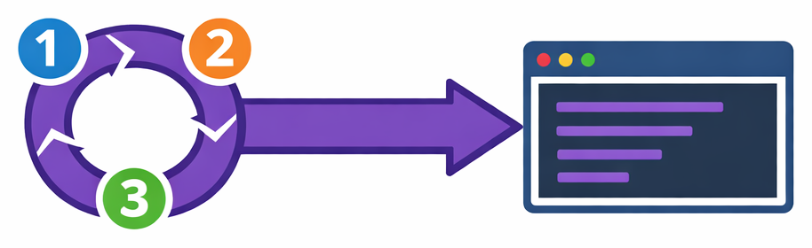
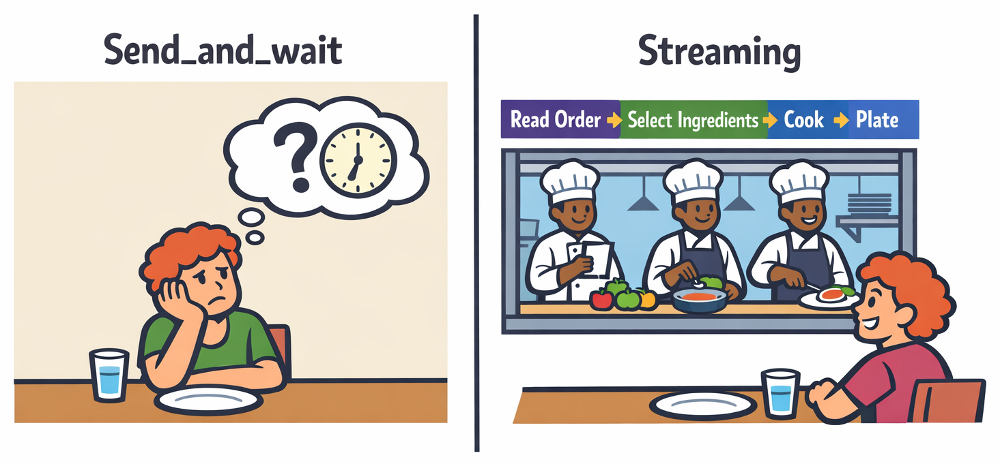
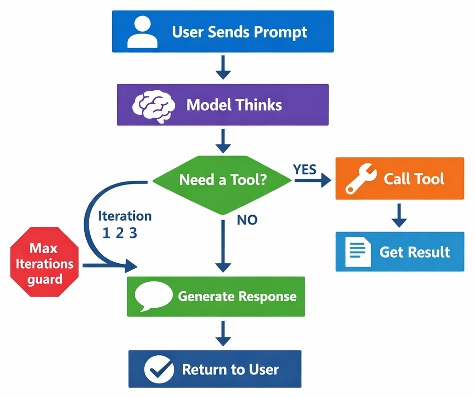

# Chapter 04 — The Agent Loop & Streaming UX



> **A great AI experience isn't just about the answer — it's about showing the thinking along the way.**

In the previous chapter, you added tools to your agent. When you called `send_and_wait`, the SDK silently ran the entire reasoning loop — thinking, calling tools, processing results — and only gave you the final answer. That works, but from the user's perspective the app freezes while thinking. This chapter teaches you how to show real-time progress with streaming and understand the agent loop that powers multi-step reasoning.

> ⚠️ **Prerequisites**: Make sure you've completed **[Chapter 03: Tool Calling](../03-tool-calling/README.md)** first. You'll need understanding of Python `async` / `await` and `pydantic` installed.

## 🎯 Learning Objectives

By the end of this chapter, you'll be able to:

- Explain how the agent reasoning loop works
- Enable streaming responses to show progressive output
- Listen for streaming events like `assistant.message_delta`
- Display tool usage progress in real time
- Set iteration limits to prevent infinite loops

> ⏱️ **Estimated Time**: ~45 minutes (15 min reading + 30 min hands-on)

---

# Understanding the Agent Loop

## 🧩 Real-World Analogy: The Open Kitchen



Imagine two restaurants. At the first, you order and then stare at a blank wall for 20 minutes until a plate appears. At the second, there's an **open kitchen** — you can see the chef selecting ingredients, firing the grill, plating the dish. The food takes the same time, but the experience is completely different.

| Closed Kitchen (send_and_wait) | Open Kitchen (Streaming) |
|---|---|
| You wait in silence | You see each step as it happens |
| You wonder if something went wrong | You know exactly what's being prepared |
| You get the final dish all at once | You see ingredients, cooking, plating — then the dish |

Streaming turns your agent from a closed kitchen into an open one. The model is doing the same work either way — reasoning, calling tools, building a response — but with streaming, your user can watch each step unfold in real time.

The **agent loop** is the chef's process: read the order (prompt), decide what's needed (reasoning), grab an ingredient (tool call), check the result, decide if more is needed, and finally plate the dish (final response). Streaming lets you narrate that entire process to the user.

---

# Key Concepts

Let's understand the building blocks before diving into code.

**The pattern here — Observe → Inform → Complete — is how you make any long-running async agent feel responsive and transparent.**

<details>
<summary>🧭 Framework You Can Reuse Later: Observe -> Inform -> Complete (optional on first read)</summary>

If this is your first pass, you can skip this and come back after the streaming demo.

Streaming UX is a portable design pattern for agent applications:

1. Observe internal progress events
2. Inform users in real time with meaningful status updates
3. Complete with a clear final state and output

| Workflow Stage | Event Signal | User-Facing Message |
|---|---|---|
| Reasoning and generation | `assistant.message_delta` | incremental response text |
| Tool execution begins | `tool.execution_start` | "Fetching context..." |
| Tool execution ends | `tool.execution_complete` | "Context loaded" |
| Agent finished | `assistant.message` / idle state | "Review complete" |

</details>

---

## The Agent Reasoning Loop

When you call `send_and_wait`, the SDK doesn't just make a single API call. It runs a **loop**:



Here's what happens in each iteration:

1. **The model receives** the conversation so far (system prompt + messages + tool results)
2. **The model reasons** about what to do next — call a tool for more information, or generate a response
3. **If a tool call is warranted**, the SDK runs your handler and feeds the result back into the loop
4. **If a response is ready**, the loop ends and the result is returned to you

> 💡 **Your Loop**: Every step of this reasoning happens according to rules you set — your system prompt, your tools, your iteration limits. The SDK executes the workflow you designed.

This loop can run multiple iterations. For example, your Issue Reviewer might:

- **Iteration 1**: Read the issue, decide to fetch `src/auth/login.py`
- **Iteration 2**: Read the file contents, decide to also fetch `src/auth/tokens.py`
- **Iteration 3**: Analyze both files and generate the final review

---

## Preventing Infinite Loops

What if the model keeps calling tools forever? The SDK includes a default iteration limit, but **you should design your prompts and tool set to stay within bounds**:

```python
# Design your system prompt to constrain tool usage
session = await client.create_session(
    on_permission_request=PermissionHandler.approve_all,
    model="gpt-4.1",
    system_message={
        "mode": "replace",
        "content": """Analyze the issue and respond with your assessment.
        
IMPORTANT: Read at most 3 files. If an issue references more than 3 files,
analyze the first 3 and note the others in your response."""
    },
    tools=[get_file_contents]
)
```

> 💡 **Your Responsibility**: Limiting tool usage in the system prompt is part of your system design. Think through: How many tool calls make sense for this task? What's a reasonable bound? Write that directly into your instructions.

> 🛡️ **Defense in Depth**: The SDK's iteration limit is a safety net, but don't rely on it. Instead, design with constraints from the start — fewer tools, clearer instructions, smaller scopes. A well-designed system should naturally stay within bounds.

---

## Streaming Responses

Instead of waiting for the complete response, you can **stream** it — receiving text as the model generates it, word by word. Enable streaming in your session configuration:

```python
session = await client.create_session(
    on_permission_request=PermissionHandler.approve_all,
    model="gpt-4.1",
    system_message={
        "mode": "replace",
        "content": "You are a GitHub issue reviewer."
    },
    tools=[get_file_contents],
    streaming=True,  # ← Enable streaming
)
```

---

## Listening for Streaming Events

With streaming enabled, you can hook into events as they happen. The SDK calls a **single event handler** you register with `session.on()`. Use Python's `match/case` to dispatch by event type:

```python
from copilot.generated.session_events import (
    AssistantMessageDeltaData, AssistantMessageData,
    ToolExecutionStartData, ToolExecutionCompleteData,
)

def on_event(event):
    match event.data:
        case AssistantMessageDeltaData():
            # Stream text as it arrives
            print(event.data.delta_content, end="", flush=True)
        case AssistantMessageData():
            # Full message assembled — response complete
            print("\n\n--- Response complete ---")
        case ToolExecutionStartData():
            # Model is calling a tool
            print(f"\n🔧 Calling: {event.data.tool_name}...")
        case ToolExecutionCompleteData():
            # Tool finished
            print("✅ Done\n")

session.on(on_event)
```

> 📚 **Glossary**: New to `match/case`? This is Python 3.10+ **structural pattern matching** — it matches the *type* of `event.data`, which is why `AssistantMessageDeltaData()` works without arguments. See Python docs for details.

Combining these events, you get an experience like:

```
🔧 Calling: get_file_contents...
✅ Done
🔧 Calling: get_file_contents...
✅ Done

Based on my analysis of the issue and the referenced files...
The authentication bypass in login.py occurs because...
```

---

# See It In Action

Let's build a streaming agent that shows real-time progress.

> 💡 **About Example Outputs**: The sample outputs shown throughout this course are illustrative. Because AI responses vary each time, your results will differ in wording, formatting, and detail.

## Building a Streaming Agent

Create a file called `streaming_agent.py`:

```python
import asyncio
from copilot import CopilotClient, define_tool
from copilot.session import PermissionHandler
from copilot.generated.session_events import (
    AssistantMessageDeltaData, AssistantMessageData,
    ToolExecutionStartData, ToolExecutionCompleteData,
)
from pydantic import BaseModel, Field
import os


class GetFileParams(BaseModel):
    file_path: str = Field(description="Relative path to the file")


@define_tool(description="Read the contents of a file from the repository")
async def get_file_contents(params: GetFileParams) -> str:
    repo_root = os.environ.get("REPO_PATH", ".")
    full_path = os.path.realpath(os.path.join(repo_root, params.file_path))
    if not full_path.startswith(os.path.realpath(repo_root)):
        return "Error: Access denied"
    try:
        with open(full_path, "r") as f:
            content = f.read()
            return content[:10_000] if len(content) > 10_000 else content
    except FileNotFoundError:
        return f"Error: File not found: {params.file_path}"


async def main():
    client = CopilotClient()
    await client.start()

    session = await client.create_session(
        on_permission_request=PermissionHandler.approve_all,
        model="gpt-4.1",
        system_message={
            "mode": "replace",
            "content": """You are a GitHub issue reviewer. Analyze the issue,
fetch any referenced files, and provide a detailed assessment.

Respond in plain text with clear sections:
- Summary
- Files analyzed
- Assessment"""
        },
        tools=[get_file_contents],
        streaming=True,
    )

    # --- Single event handler dispatching with match/case ---
    def on_event(event):
        match event.data:
            case AssistantMessageDeltaData():
                print(event.data.delta_content, end="", flush=True)
            case AssistantMessageData():
                print("\n\n✅ Response complete.")
            case ToolExecutionStartData():
                print(f"\n🔧 Calling: {event.data.tool_name}...")
            case ToolExecutionCompleteData():
                print("✅ Done\n")

    session.on(on_event)

    # --- Send the issue ---
    issue = """
    Title: Fix token expiry validation

    The validate_token() function in src/auth/tokens.py doesn't check the
    'exp' claim. Expired tokens are accepted by the login handler in
    src/auth/login.py. This is a security vulnerability.
    """

    print("📋 Sending issue for review...\n")
    await session.send_and_wait(issue)

    await client.stop()


asyncio.run(main())
```

<details>
<summary>🤖 Generate this with a prompt</summary>

Copy this prompt into GitHub Copilot Chat or your preferred AI assistant:

```text
Create a Python script called streaming_agent.py using the GitHub Copilot SDK
that shows real-time streaming output. It should:
1. Import CopilotClient, define_tool from copilot; PermissionHandler from
   copilot.session; AssistantMessageDeltaData, AssistantMessageData,
   ToolExecutionStartData, ToolExecutionCompleteData from copilot.generated.session_events
2. Define a get_file_contents tool with @define_tool that reads files from a
   local repo (with path traversal protection and 10K char limit)
3. Create a session with streaming=True and on_permission_request=PermissionHandler.approve_all
4. Register a single on_event(event) handler using match/case on event.data:
   - AssistantMessageDeltaData: print delta_content with end="", flush=True
   - AssistantMessageData: print "Response complete"
   - ToolExecutionStartData: print tool_name with wrench emoji
   - ToolExecutionCompleteData: print done confirmation
5. Register with session.on(on_event)
6. Send a test issue about token expiry validation that references specific files
7. Print "Sending issue for review..." before sending

Use async/await with CopilotClient.
```

</details>

## Running the Demo

```bash
python streaming_agent.py
```

You should see output appearing progressively:

## What's Happening Under the Hood

When you run this:

1. `send_and_wait` starts the agent loop
2. The model reads the issue and decides to call `get_file_contents` for `src/auth/tokens.py`
3. The `ToolExecutionStartData` event fires — you see "🔧 Calling..."
4. Your tool handler runs and returns the file content
5. The `ToolExecutionCompleteData` event fires — you see "✅ Done"
6. The model may call another tool (loop continues)
7. When the model generates its response, `AssistantMessageDeltaData` fires for each chunk
8. When complete, `AssistantMessageData` fires once

---

## Session Idle — Knowing When Everything Is Done

The `SessionIdleData` event fires when the session has fully finished processing — all tool calls are done, all messages streamed, and no more work is pending:

```python
from copilot.generated.session_events import SessionIdleData

def on_event(event):
    match event.data:
        case SessionIdleData():
            print("\n🏁 Session is idle — all processing complete.")
        # ... other cases

session.on(on_event)
```

<details>
<summary>🤖 Generate this with a prompt</summary>

Copy this prompt into GitHub Copilot Chat or your preferred AI assistant:

```text
Add a SessionIdleData case to an existing on_event handler for the GitHub Copilot SDK
that prints a completion message. Import SessionIdleData from copilot.generated.session_events.
Register the handler with session.on(on_event).
```

</details>

This is useful when you need to perform cleanup or trigger downstream actions after the agent finishes.

---

## Building a Status Reporter

Here's a practical pattern — a status reporter that tracks the agent's progress through labeled phases:

```python
import time
from copilot.generated.session_events import (
    AssistantMessageDeltaData, AssistantMessageData,
    ToolExecutionStartData, ToolExecutionCompleteData,
)

class StatusReporter:
    def __init__(self):
        self.start_time = time.time()
        self.tools_called = 0

    def elapsed(self):
        return f"{time.time() - self.start_time:.1f}s"

    def register(self, session):
        def on_event(event):
            match event.data:
                case ToolExecutionStartData():
                    self.tools_called += 1
                    print(f"  [{self.elapsed()}] 🔧 Tool #{self.tools_called}: "
                          f"{event.data.tool_name}")
                case ToolExecutionCompleteData():
                    print(f"  [{self.elapsed()}] ✅ Complete")
                case AssistantMessageDeltaData():
                    print(event.data.delta_content, end="", flush=True)
                case AssistantMessageData():
                    print(f"\n\n📊 Finished in {self.elapsed()} "
                          f"with {self.tools_called} tool call(s)")
        session.on(on_event)
```

Usage:

```python
status = StatusReporter()
status.register(session)
```

<details>
<summary>🤖 Generate this with a prompt</summary>

Copy this prompt into GitHub Copilot Chat or your preferred AI assistant:

```text
Create a StatusReporter class for the GitHub Copilot SDK that tracks agent
progress. It should:
1. Import AssistantMessageDeltaData, AssistantMessageData, ToolExecutionStartData,
   ToolExecutionCompleteData from copilot.generated.session_events
2. __init__: record start time and initialize a tool call counter
3. elapsed(): returns formatted elapsed time string like "1.5s"
4. register(session): defines and registers a single on_event(event) handler
   using match/case on event.data:
   - ToolExecutionStartData: increments counter, prints tool number and name with timestamp
   - ToolExecutionCompleteData: prints completion with timestamp
   - AssistantMessageDeltaData: prints streaming text chunks (end="", flush=True)
   - AssistantMessageData: prints total time and tool call count
   calls session.on(on_event) to register

Use Python's time module for elapsed time tracking.
```

</details>

---

> ✅ **Milestone: Live Visibility** — Your reviewer now streams progress in real-time. You can see every tool call and every token as it arrives. The agent loop that was previously a black box is now fully observable.

---

# Practice

1. **Add timing information** — Modify the `on_delta` handler to print timestamps before each chunk

2. **Track iteration count** — Add a counter that increments each time a tool is called to see how many iterations the agent loop runs

3. **Custom progress messages** — Replace the emoji-based progress with a spinner or progress bar

4. **Session idle handling** — Register a `session.idle` handler that prints how long the entire process took

---

## 📝 Assignment

### Main Challenge: Add Streaming to Your Issue Reviewer

Extend your Issue Reviewer from Chapter 03 to show real-time progress:

1. Enable streaming in your session configuration with `"streaming": True`

2. Register event listeners for:
   - `assistant.message_delta` — print each chunk as it arrives
   - `tool.execution_start` — show which tool is being called
   - `tool.execution_complete` — confirm when tools finish

3. Build a `StatusReporter` class that tracks:
   - Total time elapsed
   - Number of tool calls
   - Final summary when complete

4. Handle the `session.idle` event for cleanup

**Success criteria**: Running your script shows real-time progress with tool calls and streaming text, then prints a summary when complete.

See [assignment.md](./assignment.md) for full instructions.

<details>
<summary>💡 Hints</summary>

**Enable streaming:**
```python
session = await client.create_session(
    on_permission_request=PermissionHandler.approve_all,
    model="gpt-4.1",
    system_message={"mode": "replace", "content": SYSTEM_PROMPT},
    tools=[get_file_contents],
    streaming=True,  # ← Add this
)
```

**Common issues:**
- Forgetting `flush=True` in print statements — output appears delayed
- Not handling the case where no tools are called
- Mixing up `AssistantMessageData` (final) with `AssistantMessageDeltaData` (chunks)

</details>

---

<details>
<summary>🔧 Common Mistakes & Troubleshooting</summary>

| Mistake | What Happens | Fix |
|---------|--------------|-----|
| Missing `flush=True` | Text appears in bursts instead of streaming | Add `flush=True` to print: `print(..., flush=True)` |
| Wrong event class import | Handler never fires | Import from `copilot.generated.session_events`, match the exact class name |
| Forgetting `end=""` | Each chunk on new line | Use `print(chunk, end="", flush=True)` |
| Not enabling streaming | No delta events fire | Add `streaming=True` to `create_session` |

### Troubleshooting

**"No streaming output appears"** — Make sure `streaming=True` is in your `create_session` call and your `on_event` handler has a `case AssistantMessageDeltaData():` branch.

**"Text appears all at once"** — You're probably missing `flush=True` in your print statement. The output buffer needs to be flushed for real-time display.

**"Tool events never fire"** — The agent might not need to call tools for simple issues. Try an issue that references specific files.

</details>

---

## 🧠 Knowledge Check

Test your understanding:

1. **What happens during each iteration of the agent loop?**
   - a) The model always calls exactly one tool
   - b) The model decides whether to call a tool or generate a response ✅
   - c) The model generates a response and then calls tools

2. **Which event data type fires for each chunk of streamed text?**
   - a) `AssistantMessageData`
   - b) `AssistantMessageDeltaData` ✅
   - c) `SessionIdleData`

3. **How can you prevent the agent from calling tools indefinitely?**
   - a) Set `streaming: False`
   - b) Don't register any event listeners
   - c) Include explicit limits in the system prompt ✅

---

# Wrap-Up

## ✅ What You Can Do Now

1. **The agent loop is multi-step** — the SDK orchestrates multiple iterations of reasoning, tool calling, and response generation automatically
2. **Streaming improves UX** — users see progress in real time instead of staring at a blank screen
3. **Events let you hook into the process** — use `session.on(handler)` with `match/case` on typed event data classes (`AssistantMessageDeltaData`, `ToolExecutionStartData`, etc.)
4. **Session idle signals completion** — handle `SessionIdleData` to know when all processing is done

> 📚 **Glossary**: New to terms like "agent loop" or "streaming"? See the [Glossary](../GLOSSARY.md) for definitions.

---

<details>
<summary>📦 Optional: Progress and reference</summary>

## 🏗️ Capstone Progress

| Chapter | Feature Added | Status |
|---------|--------------|--------|
| 00 | Basic issue summary | ✅ |
| 01 | Structured output with rich fields | ✅ |
| 02 | Reliable classification | ✅ |
| 03 | Tool calling (file fetch) | ✅ |
| **04** | **Streaming UX** | **🔲 ← You are here** |
| 05 | Safety & guardrails | 🔲 |
| 06 | Production & GitHub integration | 🔲 |

---

## ▶️ Next Step

Your agent now analyzes issues, reads files, and streams progress in real time. But what happens when someone submits a malicious issue designed to trick your agent?

In **[Chapter 05: Safety & Guardrails](../05-safety-guardrails/README.md)**, you'll learn:

- How to defend against prompt injection attacks
- Validating tool arguments with session hooks
- Enforcing file access restrictions
- Building defense in depth

You'll harden your Issue Reviewer to be production-safe.

---

## Additional Resources

> 📚 **Official Documentation**: [GitHub Copilot SDK](https://github.com/github/copilot-sdk) — full API reference and guides
>
> 📋 **Quick Reference**: [Python SDK README](https://github.com/github/copilot-sdk/blob/main/python/README.md) — setup, configuration, and examples

- 📚 [GitHub Copilot SDK — Python streaming documentation](https://github.com/nicolo-ribaudo/copilot-sdk/tree/main/packages/sdk-python)
- 📚 [Event-driven patterns in asyncio](https://docs.python.org/3/library/asyncio.html)
- 📚 [Real-time UX best practices](https://www.nngroup.com/articles/response-times-3-important-limits/)

## Ship-Readiness Checklist

- [ ] Streaming is enabled for long-running interactions
- [ ] Tool start/complete events are surfaced to users
- [ ] Final completion state is explicit and unambiguous
- [ ] UX text remains informative, not noisy
- [ ] Iteration/tool usage limits are defined in system behavior

</details>

---

**[← Back to Chapter 03](../03-tool-calling/README.md)** | **[Continue to Chapter 05 →](../05-safety-guardrails/README.md)**
