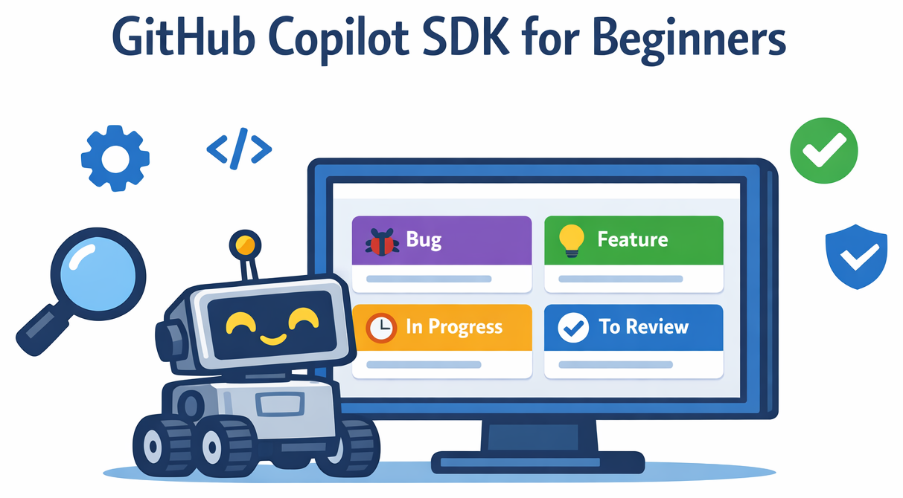
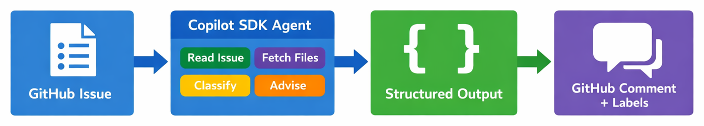

# GitHub Copilot SDK for Beginners



[](LICENSE)
[](https://github.com/microsoft/github-copilot-sdk-for-beginners/graphs/contributors)
[](https://github.com/microsoft/github-copilot-sdk-for-beginners/issues)
[](https://github.com/microsoft/github-copilot-sdk-for-beginners/stargazers)
[](https://codespaces.new/microsoft/github-copilot-sdk-for-beginners)

🎯 [What You'll Learn](#-what-youll-learn) &ensp; ✅ [Prerequisites](#-prerequisites) &ensp; 📚 [Course Structure](#-course-structure) &ensp; 📋 [Glossary](./GLOSSARY.md)

> **✨ Learn to build intelligent, tool-using AI agents with the GitHub Copilot SDK. See it in action as you build up a production-ready GitHub Issue Reviewer.**

This hands-on course teaches you to build developer tools, apps, and AI agents that can reason, plan, and take action. You'll work through 7 lessons, each adding a new capability to the capstone project: a GitHub Issue Reviewer that classifies issues, extracts concepts, and provides mentoring advice.

**No AI agent experience required.** If you know basic Python, you can learn this!

**Perfect for:** Developers who want to build AI-powered automation tools or apps, not just use them.

## 🎯 What You'll Learn

Across 7 chapters, you'll incrementally build an **AI-powered GitHub Issue Reviewer** that:

- Reads GitHub issues via the API
- Analyzes referenced files from the repository
- Classifies issue difficulty and the level of development experience needed to tackle it
- Extracts required concepts and skills
- Provides mentoring advice tailored to skill up developers
- Streams progress updates to the terminal
- Posts structured results back to GitHub

## 🔭 Where Does the Copilot SDK Fit?

GitHub Copilot has several surfaces. Here's how they differ:

| Surface | What It Does | Best For |
|---------|-------------|---------|
| **GitHub Copilot in your IDE** | Code completions and chat while you type | Everyday coding assistance |
| **GitHub Copilot Chat** | Conversational AI in your IDE or browser | Explaining code, drafting PRs, answering questions |
| **GitHub Copilot CLI** | AI commands in the terminal | Shell commands, git operations, quick lookups |
| **GitHub Copilot SDK** ← _this course_ | Build your own AI-powered tools and agents | Automation, developer tools, custom workflows |

If you want to **use** Copilot, the IDE extension and chat interfaces are great. If you want to **build with** Copilot — creating agents, automations, and tools that run in your own code — that's what the SDK is for.



## ✅ Prerequisites

- **Python 3.11+** installed
- **GitHub Copilot CLI** installed and authenticated ([Installation guide](https://docs.github.com/en/copilot/how-tos/set-up/install-copilot-cli))
- **GitHub Copilot access**: [Free offering](https://github.com/features/copilot/plans), [Monthly subscription](https://github.com/features/copilot/plans), or [Free for students/teachers](https://education.github.com/pack)*
- Basic familiarity with **Python** and **the command line**
- A **GitHub account**

## 📚 Course Structure

| Chapter | Title | Concepts Taught | Learning Goals |
|:-------:|-------|-----------------|----------------|
| 00 | 🚀 [Getting Started](./00-getting-started/README.md) | Client, Session, Message | Install SDK, send first prompt, understand agent mental model |
| 01 | 📦 [Structured Output](./01-structured-output/README.md) | JSON schema, Pydantic validation | Constrain model output to predictable, validated JSON |
| 02 | 🎯 [Prompt Engineering](./02-prompt-engineering/README.md) | Rubrics, few-shot examples, constraints | Make classification reliable and repeatable |
| 03 | 🔧 [Tool Calling](./03-tool-calling/README.md) | `@define_tool`, tool lifecycle | Give the agent the ability to read repository files |
| 04 | ⚡ [Agent Loop & Streaming](./04-agent-loop-streaming/README.md) | Agent loop, streaming events | Show real-time progress and multi-step reasoning |
| 05 | 🛡️ [Safety & Guardrails](./05-safety-guardrails/README.md) | Prompt injection, hooks, defense in depth | Harden the agent against attacks |
| 06 | 🚢 [Shipping to Production](./06-shipping-to-production/README.md) | GitHub API, logging, retries | Connect to real GitHub repos and deploy |

### 📎 Appendices (Optional)

| Appendix | Title | When to Use |
|:--------:|-------|-------------|
| A | 📚 [Scaling with RAG](./appendices/scaling-rag/README.md) | Large repositories with 1000s of files |

> 🏗️ **Curious how the whole project fits together?** See the [Capstone Project Overview](./project_outline.md) for an architecture diagram, chapter-by-chapter breakdown, and a quick-reference cheat sheet of SDK patterns.

## 🧭 Choose Your Starting Path (Optional)

All paths cover the same core chapters — these routes emphasize what's most relevant to your daily work.

<details>
<summary>I'm a developer: I want to build and automate</summary>

Start with [00](./00-getting-started/README.md), [01](./01-structured-output/README.md), [02](./02-prompt-engineering/README.md), then [03](./03-tool-calling/README.md).

Focus on: structured outputs, repeatable "plan → implement → validate" workflows, and codifying prompts into tools.

</details>

<details>
<summary>I'm a repo maintainer: I want issue triage and review automation</summary>

Start with [00](./00-getting-started/README.md), then prioritize [03](./03-tool-calling/README.md), [04](./04-agent-loop-streaming/README.md), and [06](./06-shipping-to-production/README.md).

Focus on: gathering repository context, streaming status updates, and posting structured results back to GitHub.

</details>

<details>
<summary>I'm a sysadmin or DevOps engineer: I want operational tooling</summary>

Start with [00](./00-getting-started/README.md), [03](./03-tool-calling/README.md), [05](./05-safety-guardrails/README.md), [06](./06-shipping-to-production/README.md).

Focus on: safe tool execution boundaries, structured logging, retry logic, and runbook-ready outputs.

</details>

<details>
<summary>I'm integrating AI into an existing app</summary>

Start with [01](./01-structured-output/README.md), [02](./02-prompt-engineering/README.md), then [06](./06-shipping-to-production/README.md).

Focus on: schema-first contracts between AI and your app, reliability through rubric-based prompting, and external system integration.

</details>

<details>
<summary>I'm working in a legacy codebase: I want smarter triage</summary>

Start with [02](./02-prompt-engineering/README.md), [03](./03-tool-calling/README.md), [05](./05-safety-guardrails/README.md).

Focus on: decision policies for triage, using tools for context-heavy tasks, and guardrails for safe delegation.

</details>

## 📖 How This Course Works

Each chapter follows the same pattern:

1. **Real-World Analogy**: Understand the concept through familiar comparisons
2. **Core Concepts**: Learn the essential knowledge
3. **Hands-On Demos**: Run actual code and see results
4. **Knowledge Check**: Test your understanding with quick comprehension questions
5. **Practice Assignment**: Build toward the capstone
6. **What's Next**: Preview of the following chapter

**Code examples are runnable.** Every code block in this course can be copied and executed.

<details>
<summary>Choose Your Adventure: code-first or prompt-first</summary>

Each chapter supports two learning modes:

1. **Code-first**: run the ready-made example, then inspect the prompt.
2. **Prompt-first**: generate the code from the prompt box, then compare to the example.

Use the mode that matches your pace. You can switch between them at any chapter.

</details>

## 🚀 Get Started

**Fork this repo** and complete each chapter at your own pace.

**[Start with Chapter 00 →](./00-getting-started/README.md)**

## 🏗️ How to Use This Repo

1. **Fork** this repository to your own GitHub account.
2. **Clone** your fork locally:
   ```bash
   git clone https://github.com/YOUR-USERNAME/github-copilot-sdk-for-beginners.git
   cd github-copilot-sdk-for-beginners
   ```
3. Work through each lesson **in order**, they build on each other.
4. Each chapter has a `code/` folder (starter code with TODOs) and a `solution/` folder (complete reference).
5. Complete the **assignment** at the end of each chapter to advance the capstone project.

## 🛠️ Quick Setup

```bash
# Create a virtual environment
python -m venv .venv
source .venv/bin/activate  # On Windows: .venv\Scripts\activate

# Install the GitHub Copilot SDK
pip install github-copilot-sdk

# Verify the Copilot CLI
copilot --version
```

## 🙋 Getting Help

- 🐛 **Found a bug?** [Open an Issue](https://github.com/microsoft/github-copilot-sdk-for-beginners/issues)
- 🤝 **Want to contribute?** PRs welcome! See [CONTRIBUTING.md](CONTRIBUTING.md)
- 📚 **Need definitions?** Check the [Glossary](./GLOSSARY.md)
- 📖 **Official Docs:** [GitHub Copilot SDK Documentation](https://github.com/github/copilot-sdk)

<!-- ## 👥 Meet the Team -->

<!-- TODO: Add team headshots to ./images/team/ — One image per team member (200×200 square, friendly professional headshot). Name files as firstname-lastname.png -->

<!-- *Coming soon* -->


## 📚 Other Courses in the "For Beginners" Series

| Course | Link |
|--------|------|
| GitHub Copilot CLI for Beginners | [github/github-copilot-cli-for-beginners](https://github.com/github/github-copilot-cli-for-beginners) |
| Generative AI for Beginners | [microsoft/generative-ai-for-beginners](https://github.com/microsoft/generative-ai-for-beginners) |
| ML for Beginners | [microsoft/ML-For-Beginners](https://github.com/microsoft/ML-For-Beginners) |
| Web Dev for Beginners | [microsoft/Web-Dev-For-Beginners](https://github.com/microsoft/Web-Dev-For-Beginners) |
| Data Science for Beginners | [microsoft/Data-Science-For-Beginners](https://github.com/microsoft/Data-Science-For-Beginners) |
| AI for Beginners | [microsoft/AI-For-Beginners](https://github.com/microsoft/AI-For-Beginners) |

## 📄 License

This project is licensed under the MIT License — see the [LICENSE](LICENSE) file for details.
