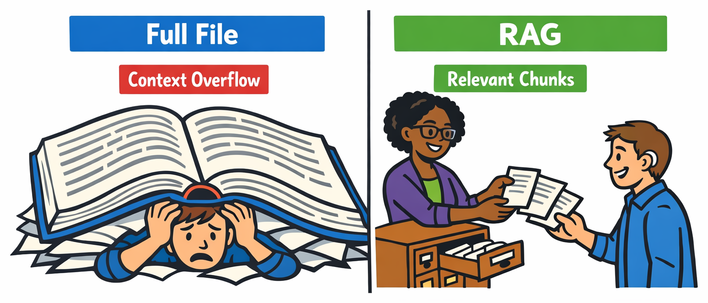
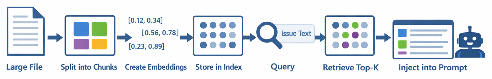

# Appendix: Scaling with Retrieval (RAG)


> **You can't send the entire codebase to the model — but you can send the right parts.**

> ⚠️ **This is optional advanced content.** The main course (Chapters 00-06) covers everything you need to build a production Issue Reviewer. This appendix is for learners who want to handle enterprise-scale repositories.

When repositories grow large, sending entire files to the model becomes impractical. Context windows have limits, and stuffing everything in leads to errors or ignored content. This appendix teaches you Retrieval-Augmented Generation (RAG) — a technique to index your codebase, search for relevant chunks, and inject only the most useful pieces into your agent's context.

> ⚠️ **Prerequisites**: Complete the main course first. You'll need `github-copilot-sdk`, `pydantic`, and `numpy` installed (`pip install numpy`).

## 🎯 Learning Objectives

By the end of this appendix, you'll be able to:

- Explain why context window limits matter for large repositories
- Chunk large files into smaller pieces
- Create simple embeddings for semantic search
- Retrieve the most relevant chunks for a given query
- Inject retrieved context into the agent's prompt

> ⏱️ **Estimated Time**: ~50 minutes (15 min reading + 35 min hands-on)

---

# Handling Large Repositories

## 🧩 Real-World Analogy: The Research Librarian



Imagine you walk into a library and ask: *"What does this 19th-century novel say about industrialization?"*

A bad librarian hands you the **entire book** — all 800 pages. *"It's in there somewhere."*

A good librarian checks the **index**, finds the three most relevant chapters, pulls those sections, and hands you just the pages you need. Same information, but delivered in a usable way.

| Bad Librarian (Full File) | Good Librarian (RAG) |
|---|---|
| Hands you the whole book | Finds the relevant pages |
| You run out of reading time | You get exactly what you need |
| Ignores that you can only read so fast | Respects your limited attention (context window) |

RAG works the same way. Your agent's context window is like a reader's limited attention span — there's a maximum amount it can process at once. Instead of stuffing the entire codebase into the prompt and hoping for the best, RAG acts as a **research librarian**: it indexes the codebase, searches for the most relevant pieces, and retrieves just those chunks for the agent to analyze.

---

# Key Concepts

<details>
<summary>🧭 Framework You Can Reuse Later: Index -> Retrieve -> Inject (optional on first read)</summary>

If this is your first pass, you can skip this and come back after trying the RAG demo.

RAG is a reusable context-management pipeline:

1. Index source material into retrievable chunks
2. Retrieve only the top-k relevant chunks per query
3. Inject selected context into the model prompt

| Scenario | Retrieval Target |
|---|---|
| Code issue analysis | functions, modules, and error paths tied to the issue |
| Documentation agent | sections matching user intent and terminology |
| Incident assistant | runbooks and historical incidents with similar symptoms |
| Compliance review | policy excerpts mapped to reported behavior |

</details>

## The Context Window Problem

Your Issue Reviewer uses the `get_file_contents` tool to read files. That works great for small files — but what happens when a file is 5,000 lines long? Or when the issue references 10 files?

You'll hit the model's **context window limit**. Every model has a maximum number of tokens it can process at once. If you exceed it, the API will return an error or the model will ignore some of the input.

**Retrieval-Augmented Generation (RAG)** solves this by:

1. Splitting files into smaller **chunks**
2. Creating **embeddings** (numerical representations) of each chunk
3. When the agent needs context, **searching** for the most relevant chunks
4. Injecting only the **top results** into the prompt



---

## Context Window Limits

Models have a fixed context window:

| Model | Context Window |
|-------|---------------|
| gpt-4.1 | 128K tokens |
| gpt-5 | 128K tokens |
| claude-sonnet-4.5 | 200K tokens |

That sounds like a lot, but consider:

- 1 token ≈ 4 characters of code
- A 2,000-line Python file ≈ 15,000–25,000 tokens
- 5 files = 75,000–125,000 tokens
- Plus the system prompt, issue text, and conversation history

You can run out of space quickly.

## Chunking Strategies

Splitting files into chunks requires strategy. Naive approaches (split every N characters) can break functions in half. Better approaches respect code structure:

```python
def chunk_by_lines(content: str, chunk_size: int = 50, overlap: int = 5) -> list[dict]:
    """Split content into chunks of approximately chunk_size lines with overlap."""
    lines = content.split("\n")
    chunks = []

    for i in range(0, len(lines), chunk_size - overlap):
        chunk_lines = lines[i:i + chunk_size]
        chunks.append({
            "content": "\n".join(chunk_lines),
            "start_line": i + 1,
            "end_line": min(i + chunk_size, len(lines)),
        })

    return chunks
```

<details>
<summary>🤖 Generate this with a prompt</summary>

Copy this prompt into GitHub Copilot Chat or your preferred AI assistant:

```text
Create a Python function called chunk_by_lines that splits text content into
overlapping chunks for RAG. It should:
1. Take content (str), chunk_size (int, default 50), and overlap (int, default 5)
2. Split content by newlines
3. Iterate with step size of (chunk_size - overlap) to create overlapping windows
4. Return a list of dicts, each with: "content" (joined lines), "start_line"
   (1-based), and "end_line"

The overlap ensures functions split at boundaries appear in adjacent chunks.
```

</details>

> 💡 **Tip**: Overlap between chunks ensures that a function split across chunk boundaries still appears (at least partially) in both chunks.

## Simple Embeddings with the SDK

You can use the Copilot SDK to create embeddings via a tool, or for simplicity, use a lightweight approach — keyword-based similarity:

```python
import re
from collections import Counter


def simple_embed(text: str) -> Counter:
    """Create a simple bag-of-words embedding."""
    words = re.findall(r'\b[a-z_][a-z0-9_]*\b', text.lower())
    return Counter(words)


def similarity(embed_a: Counter, embed_b: Counter) -> float:
    """Compute cosine similarity between two bag-of-words embeddings."""
    common = set(embed_a.keys()) & set(embed_b.keys())
    if not common:
        return 0.0
    
    dot_product = sum(embed_a[w] * embed_b[w] for w in common)
    mag_a = sum(v ** 2 for v in embed_a.values()) ** 0.5
    mag_b = sum(v ** 2 for v in embed_b.values()) ** 0.5
    
    if mag_a == 0 or mag_b == 0:
        return 0.0
    return dot_product / (mag_a * mag_b)
```

<details>
<summary>🤖 Generate this with a prompt</summary>

Copy this prompt into GitHub Copilot Chat or your preferred AI assistant:

```text
Create two Python functions for simple text similarity:
1. simple_embed(text) — creates a bag-of-words embedding by extracting
   lowercase identifier-style words (regex: \b[a-z_][a-z0-9_]*\b) and
   returning a collections.Counter
2. similarity(embed_a, embed_b) — computes cosine similarity between two
   Counter objects: find common keys, compute dot product, divide by product
   of magnitudes. Return 0.0 if no common words or zero magnitude.

Import re and Counter from collections.
```

</details>

For production systems, you'd use proper embedding models (e.g., via an embedding API), but this bag-of-words approach is enough to demonstrate the concept.

## Top-k Retrieval

Given a query and a set of embedded chunks, retrieve the `k` most similar:

```python
def retrieve_top_k(query: str, chunks: list[dict], k: int = 3) -> list[dict]:
    """Retrieve the k most relevant chunks for a query."""
    query_embed = simple_embed(query)
    
    scored = []
    for chunk in chunks:
        chunk_embed = simple_embed(chunk["content"])
        score = similarity(query_embed, chunk_embed)
        scored.append({**chunk, "score": score})
    
    scored.sort(key=lambda c: c["score"], reverse=True)
    return scored[:k]
```

<details>
<summary>🤖 Generate this with a prompt</summary>

Copy this prompt into GitHub Copilot Chat or your preferred AI assistant:

```text
Create a function called retrieve_top_k that performs semantic search over
code chunks. It should:
1. Take a query string, list of chunk dicts, and k (default 3)
2. Embed the query using simple_embed()
3. Calculate similarity score for each chunk against the query
4. Sort chunks by score in descending order
5. Return the top k results (each dict extended with a "score" field)
```

</details>

## Building a RAG-Enhanced Tool

Instead of returning the full file, your tool can now return only the relevant chunks:

```python
class ChunkIndex:
    """In-memory index of file chunks for retrieval."""
    
    def __init__(self):
        self.chunks: list[dict] = []
    
    def add_file(self, file_path: str, content: str):
        for chunk in chunk_by_lines(content, chunk_size=50, overlap=5):
            chunk["file_path"] = file_path
            self.chunks.append(chunk)
    
    def search(self, query: str, k: int = 3) -> list[dict]:
        return retrieve_top_k(query, self.chunks, k)
```

<details>
<summary>🤖 Generate this with a prompt</summary>

Copy this prompt into GitHub Copilot Chat or your preferred AI assistant:

```text
Create a ChunkIndex class for in-memory code search. It should have:
1. __init__: initialize an empty chunks list
2. add_file(file_path, content): split the content into chunks using
   chunk_by_lines(), add "file_path" to each chunk dict, and append to
   self.chunks
3. search(query, k=3): call retrieve_top_k() with the query, all chunks,
   and k to return the most relevant results
```

</details>

---

# See It In Action

Let's build a RAG-enhanced reviewer.

> 💡 **About Example Outputs**: The sample outputs shown throughout this course are illustrative. Because AI responses vary each time, your results will differ in wording, formatting, and detail.

## Building the RAG Reviewer

Create `rag_reviewer.py`:

```python
import asyncio
import json
import os
import re
from collections import Counter
from copilot import CopilotClient, define_tool
from pydantic import BaseModel, Field
from typing import Literal


# --- Chunking & Retrieval ---

def chunk_by_lines(content: str, chunk_size: int = 50, overlap: int = 5):
    lines = content.split("\n")
    chunks = []
    for i in range(0, len(lines), chunk_size - overlap):
        chunk_lines = lines[i:i + chunk_size]
        chunks.append({
            "content": "\n".join(chunk_lines),
            "start_line": i + 1,
            "end_line": min(i + chunk_size, len(lines)),
        })
    return chunks


def simple_embed(text: str) -> Counter:
    words = re.findall(r'\b[a-z_][a-z0-9_]*\b', text.lower())
    return Counter(words)


def similarity(embed_a: Counter, embed_b: Counter) -> float:
    common = set(embed_a.keys()) & set(embed_b.keys())
    if not common:
        return 0.0
    dot_product = sum(embed_a[w] * embed_b[w] for w in common)
    mag_a = sum(v ** 2 for v in embed_a.values()) ** 0.5
    mag_b = sum(v ** 2 for v in embed_b.values()) ** 0.5
    if mag_a == 0 or mag_b == 0:
        return 0.0
    return dot_product / (mag_a * mag_b)


class ChunkIndex:
    def __init__(self):
        self.chunks = []

    def add_file(self, file_path: str, content: str):
        for chunk in chunk_by_lines(content):
            chunk["file_path"] = file_path
            self.chunks.append(chunk)
        print(f"  📦 Indexed {file_path} "
              f"({len(chunk_by_lines(content))} chunks)")

    def search(self, query: str, k: int = 3):
        query_embed = simple_embed(query)
        scored = []
        for chunk in self.chunks:
            score = similarity(query_embed, simple_embed(chunk["content"]))
            scored.append({**chunk, "score": score})
        scored.sort(key=lambda c: c["score"], reverse=True)
        return scored[:k]


# --- Global index ---
index = ChunkIndex()


# --- Tool Definitions ---

class SearchParams(BaseModel):
    query: str = Field(description="Search query to find relevant code")


@define_tool(description="Search the repository for code relevant to a query. "
             "Returns the most relevant code chunks.")
async def search_code(params: SearchParams) -> str:
    results = index.search(params.query, k=3)
    if not results:
        return "No relevant code found."

    output = []
    for r in results:
        output.append(
            f"--- {r['file_path']} (lines {r['start_line']}-{r['end_line']}, "
            f"relevance: {r['score']:.2f}) ---\n{r['content']}"
        )
    return "\n\n".join(output)


# --- Schema ---

class IssueReview(BaseModel):
    summary: str
    difficulty_score: int = Field(ge=1, le=5)
    recommended_level: Literal["Junior", "Mid", "Senior", "Senior+"]
    concepts_required: list[str]
    mentoring_advice: str
    chunks_used: int = Field(description="Number of code chunks retrieved")


SYSTEM_PROMPT = """You are a GitHub issue reviewer with access to a code search tool.

Use the search_code tool to find relevant code. The tool returns the most
relevant code chunks — you don't need to read entire files.

Respond with ONLY a JSON object:
{
  "summary": "<one sentence>",
  "difficulty_score": 1-5,
  "recommended_level": "Junior | Mid | Senior | Senior+",
  "concepts_required": ["<specific skill>", ...],
  "mentoring_advice": "<guidance>",
  "chunks_used": <number of chunks you reviewed>
}
"""


async def main():
    # Pre-index some repository files
    repo_root = os.environ.get("REPO_PATH", ".")
    print("📂 Indexing repository...\n")

    for root, dirs, files in os.walk(repo_root):
        # Skip hidden directories and common non-code directories
        dirs[:] = [d for d in dirs if not d.startswith(".")
                   and d not in ("node_modules", "__pycache__", ".git", "venv")]
        for f in files:
            if f.endswith((".py", ".js", ".ts", ".md")):
                path = os.path.join(root, f)
                rel_path = os.path.relpath(path, repo_root)
                try:
                    with open(path, "r") as fh:
                        content = fh.read()
                    index.add_file(rel_path, content)
                except Exception:
                    pass

    print(f"\n✅ Indexed {len(index.chunks)} total chunks\n")

    # --- Review an issue ---
    client = CopilotClient()
    await client.start()

    session = await client.create_session({
        "model": "gpt-4.1",
        "system_message": {
            "mode": "replace",
            "content": SYSTEM_PROMPT
        },
        "tools": [search_code],
        "streaming": True
    })

    session.on("tool.execution_start",
               lambda e: print(f"  🔍 Searching: {e.data.tool_name}"))
    session.on("tool.execution_complete",
               lambda e: print(f"  ✅ Search complete\n"))

    issue = """
    Title: Fix token expiry validation in auth system

    The validate_token() function doesn't check the 'exp' claim.
    Expired JWT tokens are accepted by the login handler.
    This is a security vulnerability affecting authentication.
    """

    print("📋 Sending issue for review...\n")
    response = await session.send_and_wait({"prompt": issue})

    try:
        review = IssueReview.model_validate_json(response.data.content)
        print(f"\n  📝 {review.summary}")
        print(f"  📊 Difficulty: {review.difficulty_score}/5")
        print(f"  🧠 Concepts: {', '.join(review.concepts_required)}")
        print(f"  📦 Chunks used: {review.chunks_used}")
        print(f"  💡 Advice: {review.mentoring_advice}")
    except Exception as e:
        print(f"  ⚠️ Parse error: {e}")
        print(f"  Raw: {response.data.content[:300]}")

    await client.stop()


asyncio.run(main())
```

<details>
<summary>🤖 Generate this with a prompt</summary>

Copy this prompt into GitHub Copilot Chat or your preferred AI assistant:

```text
Create a complete RAG-enhanced issue reviewer script called rag_reviewer.py
using the GitHub Copilot SDK. It should include:

1. Chunking functions: chunk_by_lines (50-line chunks, 5-line overlap)
2. Embedding functions: simple_embed (bag-of-words with Counter) and
   similarity (cosine similarity between Counters)
3. A ChunkIndex class with add_file() and search() methods that prints
   indexing progress
4. A search_code tool using @define_tool that searches the index and
   returns the top 3 relevant chunks formatted with file path, line numbers,
   and relevance score
5. An IssueReview Pydantic model with Literal type for recommended_level
   and a chunks_used field
6. A SYSTEM_PROMPT telling the model to use search_code instead of reading
   full files
7. A main function that:
   - Walks REPO_PATH indexing .py/.js/.ts/.md files (skipping hidden dirs,
     node_modules, __pycache__)
   - Prints total chunks indexed
   - Creates a streaming session with the search tool
   - Registers tool start/complete event listeners
   - Sends a test issue about token expiry validation
   - Validates and displays the structured review

Use async/await with CopilotClient and streaming: True.
```

</details>

---

## Running the Demo

```bash
REPO_PATH=./my-repo python rag_reviewer.py
```

You'll see output like:

```
📂 Indexing repository...

  📦 Indexed src/auth/login.py (4 chunks)
  📦 Indexed src/auth/tokens.py (2 chunks)
  📦 Indexed src/auth/middleware.py (3 chunks)

✅ Indexed 42 total chunks

📋 Sending issue for review...

  🔍 Searching: search_code
  ✅ Search complete

  📝 Token expiry validation missing in auth system
  📊 Difficulty: 4/5
  🧠 Concepts: JWT validation, token expiry, middleware security
  📦 Chunks used: 3
  💡 Advice: Review the validate_token() function...
```

<details>
<summary>🎬 See it in action!</summary>


<!-- TODO: Add GIF to ./06-scaling-rag/images/rag-demo.gif — A terminal recording showing: (1) REPO_PATH=./my-repo python rag_reviewer.py command, (2) indexing output showing chunks being created, (3) search execution, (4) final structured review output. -->

*Demo output varies. Your results will differ from what's shown here.*

</details>

---

## Full File vs RAG Comparison

| Approach | Tokens Used | Files Supported | Speed |
|----------|------------|----------------|-------|
| Full file injection | ~15K per file | 3-5 files max | Slower |
| RAG (top-3 chunks) | ~2K total | Unlimited | Faster |

The RAG approach uses roughly **7× fewer tokens** while often finding the most relevant code.

---

# Practice


Time to put what you've learned into action.

---

## ▶️ Try It Yourself

After completing the demos above, try these experiments:

### 1. Compare Full-File vs RAG

Modify the tool to return the full file content. Run the same issue with both approaches and compare:

- Token usage (character count as a proxy)
- Response quality
- Speed

### 2. Tune Chunk Size

Try different chunk sizes (20, 50, 100 lines) and observe:

- Smaller chunks → more precise retrieval but less context
- Larger chunks → more context but less precision

### 3. Add Metadata to Chunks

Enhance chunks with metadata like function names, class names, or import statements. This can improve retrieval accuracy:

```python
def enhanced_chunk(content: str, file_path: str, start_line: int):
    # Extract function/class names from the chunk
    definitions = re.findall(r'^(?:def|class)\s+(\w+)', content, re.MULTILINE)
    return {
        "content": content,
        "file_path": file_path,
        "start_line": start_line,
        "definitions": definitions,
    }
```

---

## 📝 Assignment

### Main Challenge: Integrate RAG into Your Issue Reviewer

Extend your Issue Reviewer capstone project to handle large repositories:

1. **Implement the `ChunkIndex` class** with:
   - `add_file()` — add a file's content, split into chunks
   - `search()` — find the top-k most relevant chunks for a query

2. **Replace `get_file_contents`** with a `search_code` tool that uses your index

3. **Pre-index your repository** before starting the agent

4. **Update the system prompt** to instruct the agent to use search instead of full file reads

**Success criteria**: Your agent should be able to review issues in repositories with 50+ files without hitting context limits.

See [assignment.md](./assignment.md) for full instructions.

<details>
<summary>💡 Hints</summary>

**Chunking strategy:**
```python
def chunk_by_lines(content: str, chunk_size: int = 50, overlap: int = 5):
    lines = content.split("\n")
    chunks = []
    for i in range(0, len(lines), chunk_size - overlap):
        chunk_lines = lines[i:i + chunk_size]
        chunks.append({
            "content": "\n".join(chunk_lines),
            "start_line": i + 1,
            "end_line": min(i + chunk_size, len(lines)),
        })
    return chunks
```

**Common issues:**
- Forgetting to add overlap between chunks — code at boundaries gets lost
- Using too small chunk sizes — not enough context for the model
- Not pre-indexing before the agent runs — slow search during queries

</details>

---

<details>
<summary>🔧 Common Mistakes & Troubleshooting</summary>

| Mistake | What Happens | Fix |
|---------|--------------|-----|
| No chunk overlap | Functions split at boundaries are incomplete | Add 5-10 line overlap between chunks |
| Chunks too small | Model lacks context to understand code | Use 50+ lines per chunk |
| Chunks too large | Less precise retrieval | Balance with 50-100 lines |
| Embedding mismatch | Low similarity scores for relevant code | Ensure query and chunks use same embedding function |
| Not filtering directories | Index includes node_modules, .git | Skip hidden/vendor directories during indexing |

### Knowledge Check

<details>
<summary>1. Why can't you send entire large files to the model?</summary>

**b) Large files exceed the context window token limit** — Models have a fixed context window. Large files can use thousands of tokens, leaving no room for the prompt and response.

</details>

<details>
<summary>2. What does "top-k retrieval" mean?</summary>

**c) Retrieving the k most relevant chunks based on similarity** — Top-k retrieval finds the k chunks most similar to the query using embedding similarity.

</details>

<details>
<summary>3. Why use overlapping chunks?</summary>

**b) It ensures functions split at boundaries appear in both adjacent chunks** — Overlap ensures that code at chunk boundaries isn't lost — it appears in both the end of one chunk and the start of the next.

</details>

</details>

---

# Wrap-Up

## ✅ What You Can Do Now

1. **Context windows have limits** — large repositories can't be sent to the model in full; you need selective retrieval
2. **Chunking splits files into manageable pieces** — use overlap to avoid losing code at boundaries
3. **Embeddings enable semantic search** — convert text to numbers for similarity comparison
4. **Top-k retrieval finds the best matches** — only the most relevant chunks go into the prompt
5. **RAG dramatically reduces token usage** — ~7× fewer tokens while maintaining quality

> 📚 **Glossary**: New to terms like "RAG" or "embeddings"? See the [Glossary](../GLOSSARY.md) for definitions.

---

<details>
<summary>📦 Optional: Progress and reference</summary>

## 🏗️ Capstone Progress

Your Issue Reviewer can now handle large repositories!

| Chapter | Feature Added | Status |
|---------|--------------|--------|
| 00 | Basic issue summary | ✅ |
| 01 | Structured output | ✅ |
| 02 | Reliable classification | ✅ |
| 03 | Tool calling (file fetch) | ✅ |
| 04 | Streaming UX | ✅ |
| 05 | Concepts & mentoring | ✅ |
| **06** | **RAG for large repos** | **🔲 ← You are here** |
| 07 | Safety & guardrails | 🔲 |
| 08 | Evaluation & testing | 🔲 |
| 09 | Production hardening | 🔲 |

> 📝 **Note**: This chapter is an **optional advanced track** in the capstone. If RAG isn't needed for your use case (small repos), you can continue with the `get_file_contents` tool from Chapter 03.

---

## ▶️ Next Step

Your agent can now handle large repositories — but what happens when users try to trick it? Prompt injection, unsafe file access, and other adversarial inputs can compromise your system.

In **[Chapter 07: Safety & Guardrails](../07-safety-guardrails/README.md)**, you'll learn:

- How to detect and prevent prompt injection attacks
- Setting up file access restrictions
- Implementing rate limiting and abuse prevention
- Building defense-in-depth for your agent

---

## Additional Resources

> 📚 **Official Documentation**: [GitHub Copilot SDK](https://github.com/github/copilot-sdk) — full API reference and guides
>
> 📋 **Quick Reference**: [Python SDK README](https://github.com/github/copilot-sdk/blob/main/python/README.md) — setup, configuration, and examples

- 📚 [RAG (Retrieval-Augmented Generation) explained](https://research.ibm.com/blog/retrieval-augmented-generation-RAG)
- 📚 [Text embeddings guide](https://platform.openai.com/docs/guides/embeddings)

## Ship-Readiness Checklist

- [ ] Chunk strategy preserves semantic boundaries (with overlap)
- [ ] Retrieval is measured for relevance and latency
- [ ] Injected context stays within model context budget
- [ ] Index refresh strategy is defined for changed files
- [ ] Fallback behavior is defined when retrieval confidence is low

### 📚 Extra Reading: RAG Architecture Patterns

For production RAG systems, consider these patterns:

- **When RAG is necessary**: Repos > 100 files, files > 1,000 lines, context window approaching limits
- **Latency trade-offs**: Pre-indexing is slow but search is fast; full-file reads are fast but may exceed context
- **Embedding refresh**: Re-index when files change (git hooks, CI pipeline)
- **Hybrid search**: Combine keyword matching with semantic embeddings for better results
- **Chunking by AST**: Use the Abstract Syntax Tree to split at function/class boundaries instead of line counts

</details>

---

**[← Back to Chapter 05](../05-concepts-mentoring/README.md)** | **[Continue to Chapter 07 →](../07-safety-guardrails/README.md)**
